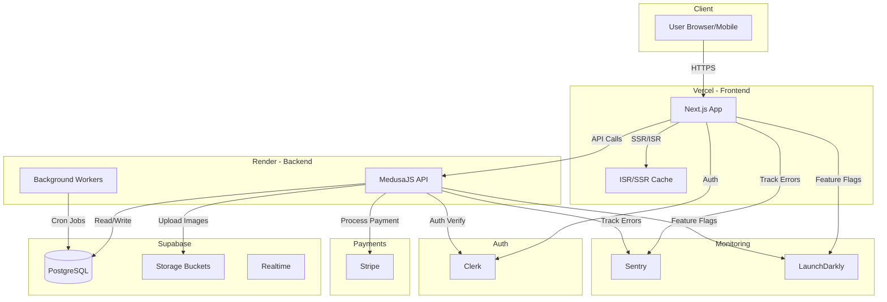

# 📐 Product Requirements Document (PRD)
## Beauty Shop – E-commerce Platform for Men's Skincare

**Version:** 1.0  
**Dato:** 14. oktober 2025  
**Status:** Active  
**Dokument ejer:** Nicklas Eskou  
**Arbejdsnavn:** Beauty Shop (endelig branding ikke fastlagt)

---

## Indholdsfortegnelse

1. [Executive Summary](#1-executive-summary)
2. [Product Overview & Vision](#2-product-overview--vision)
3. [Target User Personas](#3-target-user-personas)
4. [User Stories & Use Cases](#4-user-stories--use-cases)
5. [Feature Requirements](#5-feature-requirements)
6. [Technical Requirements](#6-technical-requirements)
7. [Success Metrics & KPIs](#7-success-metrics--kpis)
8. [Timeline & Milestones](#8-timeline--milestones)
9. [Risk Assessment](#9-risk-assessment)

---

## 1. Executive Summary

### Hvad bygger vi?

Beauty Shop er en e-commerce platform der kombinerer koreansk innovation med nordisk enkelhed for at levere curated skincare-løsninger til mænd. I stedet for at oversvømme brugeren med hundredvis af produkter, kuraterer vi komplette 3-trins kits med klare resultater og instruktioner.

### Hvorfor bygger vi det?

Mænd i alderen 20-45 er interesseret i hudpleje, men frustreret over kompleksitet og marketing-hype. De mangler en troværdig guide der kan træffe det rigtige valg for dem. Beauty Shop løser dette problem ved at være den pålidelige kurator – "Vi vælger for dig, så du slipper for at vælge forkert."

### Hvad er målet?

**Q1 2026:** Lancere soft launch med første Starter Kit og validere product-market fit med 500-1000 kunder.

**Q4 2026:** Etablere stabil abonnement-base med 30-40% recurring revenue og udvide til Advanced & Targeted Kits.

**2027+:** Udvikle eget white label produktbrand og ekspandere til Sverige, Norge og potentielt Tyskland.

### Hvem er målgruppen?

Urbane mænd 20-45 år, kvalitetsbevidste, med disponibel indkomst til premium produkter. De værdsætter æstetik, enkelhed og autenticitet – og foretrækker brands der taler ærligt frem for med hype.

### Success Criteria

- ✅ 300+ betalende kunder inden 3 måneder
- ✅ 4.5+ gennemsnitlig produkt-rating
- ✅ Break-even på første batch inden 6 måneder
- ✅ 20%+ repeat purchase rate inden 6 måneder

---

## 2. Product Overview & Vision

### 2.1 Problemstilling

**Nuværende situation:**
- Hudplejemarkedet for mænd er fragmenteret og forvirrende
- Hundredvis af produkter med modstridende budskaber
- Marketing-hype frem for ærlighed om ingredienser og resultater
- Komplekse multi-step rutiner der virker uoverskuelige
- Kvinder-fokuseret æstetik der ikke appellerer til mænd

**Brugerens frustrationer:**
- "Jeg ved ikke hvad min hud har brug for"
- "Der er for mange produkter at vælge imellem"
- "Jeg har ikke tid til at researche ingredienser"
- "Kan jeg stole på at det faktisk virker?"
- "Det føles feminint – er det overhovedet til mænd?"

### 2.2 Løsning

Beauty Shop løser dette ved at:

1. **Kuratere i stedet for at oversvømme:** Få, nøje udvalgte kits frem for uendelige produktlinjer
2. **Forenkle hudplejerutinen:** 3 trin, 5 minutter, tydeligt resultat
3. **Bygge tillid gennem gennemsigtighed:** Ærlige ingredienslister og realistiske forventninger
4. **Skabe maskulin æstetik:** Nordisk design uden stereotyper
5. **Educate brugeren:** Videoguider og klare forklaringer af "hvorfor"

### 2.3 Kerneværdiforslag

> **"Vi vælger for dig – så du slipper for at vælge forkert."**

- **Færre valg, bedre resultater:** 3-trins kit i stedet for 10+ produkter
- **Kvalitet uden kompromis:** Kun produkter vi selv bruger og tror på
- **Transparent proces:** Vis ingredienser, sourcing, forventede resultater
- **Nordisk × Koreansk fusion:** Det bedste fra to verdener
- **Design som indeholder mening:** Alt fra emballage til UI afspejler ro og kvalitet

### 2.4 Vision

**Kortsigtet (2025-2026):**
Etablere Beauty Shop som Nordens mest troværdige brand for mænds hudpleje gennem curated commerce og exceptional customer experience.

**Mellemlang sigt (2027-2028):**
Udvikle eget produktbrand med white label produktion, ekspandere til skandinaviske og europæiske markeder, og opbygge en loyal community omkring intelligent self-care.

**Langsigtet (2029+):**
Skabe et nordisk beauty-univers, hvor egenpleje bliver naturlig og intelligent — uanset køn. Udvikle et komplet wellness universe der udvider til body care, hair care og lifestyle produkter – altid med samme principper: ærlighed, enkelhed og kvalitet.

### 2.5 Product Positioning

| Dimension | Beauty Shop's Tilgang |
|-----------|-----------------|
| **Kategori** | Premium curated K-beauty for mænd |
| **Pris** | Mid-to-premium (600-1200 DKK per kit) |
| **Distribution** | Direct-to-consumer (D2C) via egen webshop |
| **Brand persona** | Ærlig ven der har researched for dig |
| **Tone** | Rolig, direkte, maskulin uden overdrivelse |
| **Differentiator** | Vi træffer produktvalget for kunden |

### 2.6 Konkurrencevurdering

**vs. Bulldog Skincare:**
- ✅ Bedre: Premium kvalitet, curated kits, nordisk design
- ❌ Udfordring: Bulldog har retail presence og brand recognition

**vs. The Ordinary:**
- ✅ Bedre: Simpelt koncept (ikke overvældende), målrettet mænd
- ❌ Udfordring: The Ordinary har lavere pris og cult-følgerskab

**vs. Traditional K-beauty (COSRX, Innisfree):**
- ✅ Bedre: Curated (eliminerer choice paralysis), nordisk branding
- ❌ Udfordring: K-beauty brands har etableret produktsortiment

**Competitive Advantage:**
Vores unikke kombination af koreansk effektivitet, nordisk æstetik og curated approach med maskulin branding gør os svære at kopiere. Vi er ikke bare endnu et brand – vi er en guide.

---

## 3. Target User Personas

### Persona 1: "Martin – Den Nysgerrige Starter"

**Demografi:**
- 28 år
- Marketing Manager i tech-virksomhed
- Bor i København (Nørrebro)
- Årlig indkomst: 550.000 DKK
- Single, aktivt dater

**Adfærd:**
- Følger nordiske design-brands (Hay, &Tradition, Aesop)
- Bruger Instagram og TikTok dagligt
- Går til frisør hver måned
- Køber tøj fra COS, Arket, Norse Projects
- Går op i fitness og protein-shakes

**Nuværende hudpleje:**
- Bruger basic face wash fra supermarkedet
- Fugtcreme når huden føles tør
- Ingen struktur eller konsistent rutine

**Motivationer:**
- Vil gerne se bedre ud til dates og profesionelle sammenhænge
- Nysgerrig på K-beauty efter at høre venner snakke om det
- Værdsætter kvalitet og er villig til at investere
- Ønsker en simpel rutine der "bare virker"

**Frustrationer:**
- "Jeg ved ikke hvor jeg skal starte"
- "Der er for mange produkter – hvilke har jeg reelt brug for?"
- "Jeg har ikke tid til at researche ingredienser"
- "Jeg vil ikke have noget der lugter feminint"

**Goals:**
- Få klarere hud og mindre fedtet T-zone
- Have en konsistent morgenrutine
- Føle sig mere put-together

**Citater:**
> "Jeg vil gerne tage bedre vare på min hud, men jeg aner ikke hvor jeg skal starte. Jeg har ikke lyst til at bruge timer på research – jeg vil bare have noget der virker."

**Hvordan Beauty Shop løser Martins behov:**
- ✅ Starter Kit giver komplet løsning uden research
- ✅ Klar 3-trins struktur = nem at følge
- ✅ Maskulin æstetik passer til hans stilpræferencer
- ✅ Videoguide viser præcis hvordan det bruges
- ✅ Premium kvalitet matcher hans brand-præferencer

---

### Persona 2: "Jonas – Den Etablerede Enthusiast"

**Demografi:**
- 38 år
- Senior Consultant i finanssektoren
- Bor i Aarhus (Midtbyen)
- Årlig indkomst: 750.000 DKK
- Gift, 1 barn (3 år)

**Adfærd:**
- Læser tech & lifestyle blogs
- Køber produkter baseret på reviews og anmeldelser
- Værdsætter bæredygtighed og gennemsigtighed
- Loyal overfor brands han stoler på
- Bruger både desktop og mobile til shopping

**Nuværende hudpleje:**
- Bruger allerede basic K-beauty (The Ordinary)
- Har en rutine, men føler den kan optimeres
- Prøvet flere brands men mangler konsistens
- Irriteret over at skulle sammensætte selv

**Motivationer:**
- Vil have professionel guidance til produkt-valg
- Ønsker premium kvalitet og proven results
- Vil gerne spare tid på research og trial-and-error
- Værdsætter brands med stærk story og values

**Frustrationer:**
- "Jeg bruger 5-6 produkter, men jeg ved ikke om de passer sammen"
- "Jeg har prøvet så mange brands – hvor er den stabile løsning?"
- "Jeg vil gerne noget mere premium end The Ordinary"
- "Jeg har ikke tid til at blive ved med at eksperimentere"

**Goals:**
- Optimere eksisterende rutine med bedre produkter
- Reduce trial-and-error og finde en long-term løsning
- Støtte nordiske brands med autentiske values

**Citater:**
> "Jeg har forsøgt at sammensætte min egen rutine, men der er så mange variable. Jeg vil gerne have ekspertens anbefalinger – en der faktisk ved hvad de snakker om, ikke bare endnu en influencer."

**Hvordan Beauty Shop løser Jonas' behov:**
- ✅ Curated kits er sammensat af eksperter (ikke trial-and-error)
- ✅ Premium kvalitet = upgrade fra The Ordinary
- ✅ Transparent om sourcing og ingredienser = tillid
- ✅ Advanced Kit giver dybere pleje når han er klar
- ✅ Subscription model sparer tid og sikrer konsistens

---

### Persona 3: "Emma – Den Attentive Partner"

**Demografi:**
- 31 år
- UX Designer i startup
- Bor i København (Vesterbro)
- Årlig indkomst: 500.000 DKK
- I forhold (3 år) med Simon (34)

**Adfærd:**
- Køber ofte gaver til kæreste
- Aktiv på Instagram (følger beauty & design accounts)
- Værdsætter thoughtful, kvalitative gaver
- Shopper online (Zalando, COS, niche brands)
- Bruger selv avanceret skincare

**Motivation for køb:**
- Vil gerne give kæresten en bedre hudplejerutine
- Frustreret over at han kun bruger soap bar
- Ønsker en gave der er praktisk og thoughtful
- Vil have noget der matcher deres shared aesthetic

**Frustrationer:**
- "Han bruger bare mit face wash – det er ikke optimalt for hans hud"
- "Jeg ved ikke hvad der passer til mænds hud specifikt"
- "Jeg vil ikke virke pushy, det skal føles som en god gave"
- "Alt til mænd ser enten basic ud eller overdrevent 'tough guy'"

**Goals:**
- Finde et starter-kit der matcher hans (minimale) engagement-niveau
- Noget der ser godt ud i deres badeværelse (design-match)
- En gave der faktisk bliver brugt (ikke bare står uåbnet)

**Citater:**
> "Jeg vil gerne hjælpe Simon med at tage bedre vare på sin hud, men jeg ved at hvis det er for komplekst, dropper han det bare. Jeg har brug for noget der er nemt at starte med – og som faktisk ser maskulint og cool ud."

**Hvordan Beauty Shop løser Emmas behov:**
- ✅ Starter Kit er perfekt gave til begyndere
- ✅ Premium emballage = flot gave-oplevelse
- ✅ Maskulin æstetik = han vil faktisk bruge det
- ✅ Simple 3-step guide = lavt commitment
- ✅ Giftable packaging + optional gift note

---

### Persona-sammenligning

| Dimension | Martin (Starter) | Jonas (Enthusiast) | Emma (Gift-Giver) |
|-----------|------------------|-------------------|------------------|
| **Primært behov** | Simpel start | Optimering | Thoughtful gave |
| **Entry product** | Starter Kit | Advanced Kit | Starter Kit (gave) |
| **Engagement-niveau** | Lavt til medium | Medium til højt | Proxy (køber for anden) |
| **Price sensitivity** | Medium | Lav | Medium |
| **Key trigger** | Social proof | Expert credibility | Design + usability |
| **Channel preference** | Instagram/TikTok | Google/Reviews | Instagram |

---

## 4. User Stories & Use Cases

### 4.1 Epics & User Stories

#### Epic 1: Discovery & Research

**As a new visitor, I want to understand what Beauty Shop offers, so I can decide if it's right for me.**

**User Stories:**
- **US-001:** As a new visitor, I want to see a clear value proposition on the homepage, so I understand the brand immediately.
  - **Acceptance Criteria:**
    - Hero section with tagline "Vi vælger for dig – så du slipper for at vælge forkert"
    - Visual showing 3-step ritual
    - CTA button to "Se Starter Kit"
    - Load time < 2 seconds

- **US-002:** As a curious visitor, I want to learn about the 3-step ritual, so I understand how it works.
  - **Acceptance Criteria:**
    - Dedicated section explaining Step 1 (Cleanse), Step 2 (Treat), Step 3 (Protect)
    - Visual timeline or icons for each step
    - 1-2 sentence explanation per step
    - Time estimate: "5 minutter om morgenen"

- **US-003:** As a skeptical visitor, I want to see social proof, so I can trust the brand.
  - **Acceptance Criteria:**
    - Customer reviews (when available)
    - "Trusted by 500+ mænd" counter
    - Media mentions or influencer endorsements
    - Real customer photos (not stock)

---

#### Epic 2: Product Discovery

**As a potential customer, I want to explore the Starter Kit, so I can make an informed purchase decision.**

**User Stories:**
- **US-004:** As a potential customer, I want to see what's inside the Starter Kit, so I know exactly what I'm buying.
  - **Acceptance Criteria:**
    - "Inside the Kit" section with 3 products shown
    - Each product has name, image, short description
    - Ingredient highlights (e.g., "Centella Asiatica, Niacinamide")
    - Expected results: "Klar, balanceret hud efter 2-4 uger"

- **US-005:** As a detail-oriented customer, I want to read full ingredient lists, so I can check for allergens.
  - **Acceptance Criteria:**
    - Expandable "Full ingredients" section per product
    - INCI names (international naming)
    - "Free from" badges (parfume, parabener, alkohol)
    - Link to "Ingredient glossary" for curious users

- **US-006:** As a visual learner, I want to see how to use the products, so I don't make mistakes.
  - **Acceptance Criteria:**
    - Embedded short video (30-60 sec) showing application
    - Or step-by-step visual guide with photos
    - Danish language
    - Optional: QR code for mobile viewing

---

#### Epic 3: Purchase Flow

**As a decided customer, I want a smooth checkout, so I can complete my purchase quickly.**

**User Stories:**
- **US-007:** As a first-time buyer, I want to add the Starter Kit to cart, so I can proceed to checkout.
  - **Acceptance Criteria:**
    - "Tilføj til kurv" button clearly visible
    - Add-to-cart confirmation (toast or modal)
    - Cart icon updates with item count
    - Option to continue shopping or go to checkout

- **US-008:** As a customer, I want to review my cart, so I can verify items before paying.
  - **Acceptance Criteria:**
    - Cart page shows: product image, name, quantity, price
    - Option to adjust quantity or remove item
    - Subtotal, shipping cost, and total clearly displayed
    - Estimated delivery time shown
    - "Fortsæt til betaling" CTA button

- **US-009:** As a customer, I want to create an account or checkout as guest, so I have flexibility.
  - **Acceptance Criteria:**
    - Option for "Opret konto" (via Clerk)
    - Option for "Fortsæt som gæst"
    - Social login options (Google, Apple)
    - Email + password signup
    - No friction – max 2 clicks to start checkout

- **US-010:** As a customer, I want to enter shipping & payment info securely, so I can complete purchase.
  - **Acceptance Criteria:**
    - Form pre-filled if logged in
    - Address validation (postal code lookup)
    - Payment via Stripe (card, Apple Pay, Google Pay)
    - SSL encryption badge visible
    - "Bekræft ordre" button

- **US-011:** As a customer, I want order confirmation, so I know my purchase was successful.
  - **Acceptance Criteria:**
    - Success page with order number
    - Email confirmation sent within 1 minute
    - Order details: items, total, shipping address
    - Tracking link (when available)
    - "Hvad sker der nu?" timeline shown

---

#### Epic 4: Post-Purchase Experience

**As a customer, I want clear guidance after receiving my kit, so I can use it correctly.**

**User Stories:**
- **US-012:** As a customer, I want a premium unboxing experience, so I feel the quality.
  - **Acceptance Criteria:**
    - Mat, debossed emballage (kraft brown eller stone grey)
    - Products securely packed
    - Instruction card included (physical)
    - QR code to video guide
    - Thank you note from founder (optional)

- **US-013:** As a new user, I want step-by-step instructions, so I use products correctly.
  - **Acceptance Criteria:**
    - Instruction card with "Step 1-2-3"
    - Visual icons (cleanser, treat, protect)
    - Amount to use per step (e.g., "Hasselnød størrelse")
    - Morning vs. evening usage
    - QR code links to video guide (1-2 min, Danish)

- **US-014:** As a customer, I want to see when I need to refill, so I don't run out.
  - **Acceptance Criteria:**
    - Email reminder at 6 weeks (assuming 8-week usage)
    - "Dit kit går snart tom – bestil refill nu"
    - CTA button to re-order or subscribe
    - Optional: offer 10% discount on subscription

---

#### Epic 5: Retention & Loyalty

**As a satisfied customer, I want to stay engaged, so I continue using Beauty Shop.**

**User Stories:**
- **US-015:** As a repeat customer, I want to subscribe, so I don't have to remember to re-order.
  - **Acceptance Criteria:**
    - "Tilmeld abonnement" option on product page
    - Choose frequency: every 8 weeks, 10 weeks, 12 weeks
    - 10% discount on subscription orders
    - Easy to pause or cancel (self-service)

- **US-016:** As a customer, I want to share my experience, so I can get referral benefits.
  - **Acceptance Criteria:**
    - Post-purchase email asks for review (after 4 weeks)
    - Review link with simple rating + comment
    - Option to share on social media
    - Referral program: "Giv 50 kr, få 50 kr" (phase 2)

- **US-017:** As an advanced user, I want to upgrade to Advanced Kit, so I can level up my routine.
  - **Acceptance Criteria:**
    - Email campaign after 3 months: "Klar til næste trin?"
    - Show comparison: Starter Kit vs. Advanced Kit
    - Upsell with clear benefits (serum, eksfoliant)
    - Smooth upgrade flow (no re-entering info)

---

### 4.2 Detailed Use Cases

#### Use Case 1: First-Time Visitor → Purchase

**Actor:** Martin (28, nysgerrig starter)

**Precondition:** Martin har hørt om Beauty Shop via Instagram-post fra en ven.

**Main Flow:**
1. Martin lander på homepage (fra Instagram link)
2. Ser hero section med tagline og visuel af 3-step ritual
3. Scroller ned, ser "Hvad er et kit?" forklaring
4. Klikker på "Se Starter Kit" button
5. Lander på Starter Kit produktside
6. Ser "Inside the Kit" med 3 produkter
7. Læser kort om hver (cleanser, toner, moisturizer)
8. Ser video demo (30 sek) af hvordan det bruges
9. Klikker "Tilføj til kurv"
10. Toast notification: "Starter Kit tilføjet!"
11. Klikker på kurv-ikon
12. Gennemgår cart: 1x Starter Kit, 899 DKK
13. Klikker "Fortsæt til betaling"
14. Vælger "Opret konto" via Google login
15. Clerk modal → Google OAuth → authenticated
16. Shipping form pre-fyldt med info fra Google
17. Verificerer adresse (København)
18. Indtaster betalingsinfo (Stripe Checkout)
19. Bekræfter ordre
20. Success page med ordrenummer
21. Modtager bekræftelsesmail inden for 1 minut

**Postcondition:** 
- Martin har en ordre i systemet
- Email-sekvens startes (order confirmation → shipping notification)
- Martin er nu logged-in kunde

**Alternative Flows:**
- **A1:** Hvis Martin ikke er klar til at købe, kan han tilmelde sig newsletter i stedet
- **A2:** Hvis checkout fejler (payment decline), vises fejl og mulighed for at prøve igen
- **A3:** Hvis Martin forlader checkout, trigges abandoned cart email efter 24 timer

**Business Rules:**
- Minimum ordre: 1x kit (ingen single products i MVP)
- Shipping: 49 DKK (gratis ved ordre over 500 DKK)
- Payment methods: Dankort, Visa, Mastercard, Apple Pay, Google Pay

---

#### Use Case 2: Returning Customer → Subscription

**Actor:** Jonas (38, etableret enthusiast, har købt 2 gange før)

**Precondition:** Jonas har brugt Starter Kit i 3 måneder og er tilfreds.

**Main Flow:**
1. Jonas logger ind via magic link i email
2. Går til "Min konto" → "Ordre historik"
3. Ser tidligere ordrer: 2x Starter Kit (August, Oktober)
4. Klikker på "Tilmeld abonnement" banner
5. Lander på subscription setup page
6. Vælger produkt: Starter Kit
7. Vælger frekvens: Hver 8. uge
8. Ser prissammenligning: 899 DKK → 809 DKK (10% rabat)
9. Bekræfter "Start abonnement"
10. Automatisk trækning hver 8. uge
11. Email reminder 3 dage før næste levering
12. Modtager kit automatisk

**Postcondition:**
- Jonas er nu på recurring subscription
- Næste order scheduled til uge 8
- Jonas kan pause/cancel når som helst via "Min konto"

**Alternative Flows:**
- **A1:** Jonas kan ændre frekvens (8 → 10 uger) uden at annullere
- **A2:** Jonas kan pause i 4 uger (fx ved ferie)
- **A3:** Jonas kan skifte til Advanced Kit i subscription

**Business Rules:**
- Subscription discount: 10% off every order
- Billing: automatisk 3 dage før shipping
- Cancelation: ingen binding, stop når som helst
- Pause: op til 12 uger

---

#### Use Case 3: Gift Purchase

**Actor:** Emma (31, køber gave til kæreste Simon)

**Precondition:** Emmas kærestes fødselsdag nærmer sig.

**Main Flow:**
1. Emma finder Beauty Shop via Instagram Explore
2. Læser om konceptet, synes det er perfekt til Simon
3. Går til Starter Kit produktside
4. Klikker "Køb som gave" toggle
5. Tilføjer til kurv
6. I checkout, vælger "Dette er en gave"
7. Checkbox aktiverer gave-options:
   - Inkluder gave-note (150 tegn)
   - Skjul pris på pakkeliste
   - Send separat shipping notification til modtager
8. Emma skriver gave-note: "Glæder mig til at se dig bruge det! ❤️ - Emma"
9. Indtaster Simons adresse (ikke sin egen)
10. Bekræfter ordre
11. Simon modtager pakke med gave-note
12. Emma får separat email: "Din gave er leveret til Simon"

**Postcondition:**
- Simon modtager kit med gave-note
- Ingen pris vist i pakken
- Simon får invitation til at oprette sin egen konto (optional)

**Alternative Flows:**
- **A1:** Emma kan vælge leveringsdato (fx til præcis fødselsdag)
- **A2:** Emma kan vælge gave-emballage (upgrade for 29 DKK)

**Business Rules:**
- Gave-note: max 150 tegn
- Ingen pris i pakke hvis gave-mode aktiveret
- Recipient får email med "Du har modtaget en gave fra Beauty Shop"

---

## 5. Feature Requirements

### 5.1 Core Features (MVP - Must Have)

#### Feature 1: E-commerce Webshop

**Beskrivelse:**  
Fuld-funktionel e-commerce platform bygget på MedusaJS med fokus på kit-baseret handel.

**Functional Requirements:**
- **FR-1.1:** Homepage med hero section, 3-step ritual, og CTA til produkter
- **FR-1.2:** Produktside for Starter Kit med "Inside the Kit" visning
- **FR-1.3:** Shopping cart med quantity adjustment og price calculation
- **FR-1.4:** Checkout flow med shipping & payment (Stripe integration)
- **FR-1.5:** Order confirmation page og email
- **FR-1.6:** Responsive design (mobile, tablet, desktop)

**Technical Specifications:**
- **Platform:** MedusaJS v2 (backend), Next.js 15 (frontend)
- **Database:** PostgreSQL (via Supabase)
- **Payment:** Stripe Checkout
- **Hosting:** Vercel (frontend), Render (backend)

**User Interface Requirements:**
- Design system: Tailwind CSS + Shadcn/ui
- Color palette: Warm White (#F8F7F5), Copper (#7A5640), Charcoal (#1C1C1C), Stone Gray (#D8D4CE), Soft Sand (#E8E3DA)
- Typography: Sans-serif (Founders Grotesk eller Inter) - Headlines bold, uppercase, bred tracking
- Spacing: 8px grid, 160px mellem hovedsektioner
- No shadows, gradients, or glossy surfaces
- Copper bruges sparsomt som håndværkselement – aldrig som pynt

**Performance Targets:**
- Page load time: < 2 seconds
- Time to Interactive (TTI): < 3 seconds
- Lighthouse score: 90+ (Performance, Accessibility, Best Practices)

**Acceptance Criteria:**
- [ ] User kan browse homepage og produktside
- [ ] User kan tilføje Starter Kit til cart
- [ ] User kan gennemføre checkout og modtage order confirmation
- [ ] All pages er responsive og fungerer på mobile
- [ ] Payment processing fungerer (test mode i MVP)

**Priority:** P0 (Critical)  
**Effort Estimate:** 3-4 uger (2 udviklere)

---

#### Feature 2: Starter Kit Product

**Beskrivelse:**  
Det første og vigtigste produkt – en komplet 3-trins hudplejerutine pakket som et bundle.

**Functional Requirements:**
- **FR-2.1:** Bundle product i MedusaJS med 3 sub-products (Cleanser, Toner, Moisturizer)
- **FR-2.2:** "Inside the Kit" UI component der viser alle 3 produkter
- **FR-2.3:** Full ingredients list per product (expandable)
- **FR-2.4:** "How to use" guide med visual steps
- **FR-2.5:** Expected results section ("Efter 2-4 uger...")

**Product Specifications:**
- **Name:** Starter Kit (working title)
- **Contents:** 3 products (Cleanser, Toner, Moisturizer)
- **Duration:** 8 weeks (ved daglig brug)
- **Target:** Normal til kombineret hud (universal start-level)

**User Interface Requirements:**
- Product image carousel (3-5 images)
- "Inside the Kit" grid layout (3 columns desktop, stacked mobile)
- Expandable sections: Ingredients, How to Use, Expected Results
- Add-to-cart button fixed on scroll (mobile)

**Content Requirements:**
- Product photography (naturligt dagslys – helst morgenlys fra siden, teksturer: beton, træ, linned)
- Short descriptions per product (30-50 ord)
- INCI ingredient lists (komplet transparency)
- "Free from" badges: alkohol, parfume, parabener (visual icons)
- Expected results copy (realistic timeline: "Klar, balanceret hud efter 2-4 uger")

**Quality Requirements (fra Notion):**
- Fokus på effektive, milde og testede koreanske formler
- Fri for: alkohol, parfume, parabener og unødvendige tilsætningsstoffer
- Produceret i Korea (certificeret OEM-partner)
- Formål: give nordisk hud fugt, balance og ro i et krævende klima

**Acceptance Criteria:**
- [ ] Product page viser bundle korrekt
- [ ] User kan se alle 3 sub-products i "Inside the Kit"
- [ ] Ingredients list er komplet og korrekt (INCI navne)
- [ ] "How to use" guide er tydelig og visual
- [ ] Expected results sætter realistiske forventninger

**Priority:** P0 (Critical)  
**Effort Estimate:** 2 uger (design + development + content)

---

#### Feature 3: Authentication & User Accounts

**Beskrivelse:**  
Sikker bruger-authentication via Clerk med support for social logins og guest checkout.

**Functional Requirements:**
- **FR-3.1:** Email + password signup/login
- **FR-3.2:** Social login (Google, Apple)
- **FR-3.3:** Guest checkout (ingen account required)
- **FR-3.4:** Magic link login (passwordless option)
- **FR-3.5:** User profile page (navn, email, adresse)
- **FR-3.6:** Order history (logged-in users only)

**Technical Specifications:**
- **Auth provider:** Clerk
- **Session management:** JWT tokens (Clerk handles)
- **Data storage:** User metadata i Supabase (synced via webhook)

**Security Requirements:**
- HTTPS only (enforced)
- Password strength validation (min 8 chars, 1 uppercase, 1 number)
- Rate limiting on login attempts (max 5/min)
- GDPR-compliant (user can request data deletion)

**User Interface Requirements:**
- Login modal (popup, ikke full page)
- Social login buttons prominent (Google, Apple)
- "Fortsæt som gæst" option tydelig
- "Glemt password?" link

**Acceptance Criteria:**
- [ ] User kan oprette konto via email
- [ ] User kan logge ind via Google eller Apple
- [ ] User kan checkout som gæst uden account
- [ ] User kan se ordre-historik når logged in
- [ ] Password reset fungerer korrekt

**Priority:** P0 (Critical)  
**Effort Estimate:** 1-2 uger

---

#### Feature 3.1: Product Packaging & Unboxing Experience

**Beskrivelse:**  
Fysisk packaging der afspejler Beauty Shop's brand DNA og skaber premium unboxing experience.

**Physical Specifications (fra Notion Product):**
- **Ydre emballage:** Kraftigt, mat pap i stone grey eller kraft brown
- **Tryk:** Debossed logo (ingen blank lak)
- **Indre emballage:** Papir eller let tekstur – enkel indpakning
- **Følelse:** Premium men rå, som noget man har lyst til at røre ved
- **Inkluderet:** Kort med simple "Step 1-2-3" instruktioner + QR-kode til dansk videoguide

**Brand Guidelines:**
- Alt skal føles som et produkt man gerne vil have stående fremme
- Visuel retning: varm, naturlig og håndværkspræget
- Ingen glossy surfaces eller corporate æstetik

**Priority:** P0 (Critical for brand experience)  
**Effort Estimate:** Design + leverandør sourcing (del af product sourcing)

---

#### Feature 4: Payment Processing

**Beskrivelse:**  
Sikker payment processing via Stripe med support for danske betalingsmetoder.

**Functional Requirements:**
- **FR-4.1:** Stripe Checkout integration
- **FR-4.2:** Support for Dankort, Visa, Mastercard
- **FR-4.3:** Apple Pay og Google Pay (mobile)
- **FR-4.4:** Shipping cost calculation (49 DKK, gratis over 500 DKK)
- **FR-4.5:** VAT calculation (25% moms for DK)

**Technical Specifications:**
- **Payment provider:** Stripe
- **Webhook setup:** Stripe → MedusaJS (payment confirmation)
- **Currency:** DKK
- **3D Secure:** Aktiveret (Strong Customer Authentication)

**Business Rules:**
- Shipping: 49 DKK (gratis ved ordre > 500 DKK)
- VAT: 25% inkluderet i alle priser
- Refund policy: 14 dages returret (standard dansk lovgivning)

**Security Requirements:**
- PCI DSS compliant (Stripe håndterer)
- No card data stored on our servers
- Webhook signature verification

**Acceptance Criteria:**
- [ ] User kan betale med Dankort/Visa/Mastercard
- [ ] Apple Pay og Google Pay fungerer på mobile
- [ ] Shipping cost beregnes korrekt
- [ ] VAT vises korrekt i checkout
- [ ] Payment confirmation webhook opdaterer ordre-status

**Priority:** P0 (Critical)  
**Effort Estimate:** 1 uge

---

#### Feature 5: Order Management

**Beskrivelse:**  
Backend-system til at håndtere ordrer, shipping notifications, og order tracking.

**Functional Requirements:**
- **FR-5.1:** Ordre oprettes efter payment success
- **FR-5.2:** Email confirmation sendes automatisk
- **FR-5.3:** Admin kan se alle ordrer (MedusaJS admin)
- **FR-5.4:** Admin kan opdatere ordre-status (processing, shipped, delivered)
- **FR-5.5:** Shipping notification email sendes ved status "shipped"

**Email Templates:**
- **Order confirmation:** "Tak for din ordre!"
  - Ordrenummer, ordrelinje, total, shipping address
  - "Hvad sker der nu?" timeline
  - Estimated delivery (3-5 hverdage)

- **Shipping notification:** "Din ordre er på vej!"
  - Tracking link (PostNord eller GLS)
  - Estimated delivery date
  - "Forbered dit badeværelse" tip

- **Delivery reminder:** "Din ordre burde være ankommet"
  - Sendes 5 dage efter shipping
  - Link til "Brug for hjælp?" support

**Admin Interface Requirements:**
- Order list view (sortable by date, status, customer)
- Order detail view (full info, payment status, shipping status)
- Quick actions: "Mark as shipped", "Refund order"

**Acceptance Criteria:**
- [ ] Ordre oprettes korrekt i system efter payment
- [ ] Order confirmation email sendes inden for 1 minut
- [ ] Admin kan se alle ordrer i MedusaJS admin
- [ ] Shipping notification sendes når status ændres til "shipped"
- [ ] Tracking link fungerer korrekt

**Priority:** P0 (Critical)  
**Effort Estimate:** 1-2 uger

---

#### Feature 6: Landing Page & Pre-launch

**Beskrivelse:**  
Pre-launch landing page til email capture før official launch.

**Functional Requirements:**
- **FR-6.1:** Hero section med value proposition
- **FR-6.2:** Email signup form (early access waitlist)
- **FR-6.3:** "Hvad er Beauty Shop?" section
- **FR-6.4:** "3-step ritual" explainer
- **FR-6.5:** Countdown til launch (optional)

**Technical Specifications:**
- Email capture via Supabase (stored in `waitlist` table)
- Email automation via Send Grid eller Mailchimp (senere)

**Content Requirements:**
- Hero headline: "Hudpleje uden støj – bygget fra grunden"
- Subheadline: "Vi vælger for dig, så du slipper for at vælge forkert"
- Email CTA: "Vær først til at få adgang"
- Social proof: "500+ mænd på venteliste" (opdateres live)

**Acceptance Criteria:**
- [ ] Landing page er live og accessible
- [ ] Email signup form fungerer
- [ ] Emails gemmes i database
- [ ] Thank you message vises efter signup
- [ ] Social proof counter opdateres automatisk

**Priority:** P1 (High)  
**Effort Estimate:** 1 uge

---

### 5.2 Nice-to-Have Features (Post-MVP)

#### Feature 7: Subscription Service

**Beskrivelse:**  
Recurring subscription model med automatisk levering hver 8-12 uge.

**Functional Requirements:**
- **FR-7.1:** User kan tilmelde subscription fra produktside
- **FR-7.2:** Vælg frekvens (8, 10, eller 12 uger)
- **FR-7.3:** 10% discount på subscription orders
- **FR-7.4:** Auto-billing 3 dage før shipping
- **FR-7.5:** Email reminder før næste order
- **FR-7.6:** Self-service pause/cancel

**Technical Specifications:**
- Stripe Subscriptions API
- MedusaJS subscription plugin (eller custom implementation)

**Priority:** P2 (Medium)  
**Effort Estimate:** 2-3 uger  
**Launch Target:** Q2 2026

---

#### Feature 8: Product Reviews & Ratings

**Beskrivelse:**  
User-generated reviews og ratings for at opbygge social proof.

**Functional Requirements:**
- **FR-8.1:** User kan skrive review 4 uger efter purchase
- **FR-8.2:** 5-star rating system
- **FR-8.3:** Text review (optional, 50-500 tegn)
- **FR-8.4:** Upload photo (optional)
- **FR-8.5:** Admin moderation før publish

**Technical Specifications:**
- Reviews stored i Supabase
- Photo upload via Supabase Storage
- Admin approval workflow

**Priority:** P2 (Medium)  
**Effort Estimate:** 2 uger  
**Launch Target:** Q2 2026

---

#### Feature 9: Referral Program

**Beskrivelse:**  
"Giv 50 kr, få 50 kr" referral program for at drive word-of-mouth.

**Functional Requirements:**
- **FR-9.1:** User får unique referral link
- **FR-9.2:** Når ven køber via link, begge får 50 kr discount
- **FR-9.3:** Discount code auto-applied ved checkout
- **FR-9.4:** Referral dashboard (hvor mange har brugt dit link?)

**Technical Specifications:**
- Referral tracking via URL params + cookie
- Discount codes genereres automatisk i MedusaJS

**Priority:** P3 (Low)  
**Effort Estimate:** 2 uger  
**Launch Target:** Q3 2026

---

#### Feature 10: Advanced Kit & Targeted Kits

**Beskrivelse:**  
Udvidelse af produktlinje med Advanced Kit (inkl. serum + eksfoliant) og hudtype-specifikke kits.

**Functional Requirements:**
- **FR-10.1:** Advanced Kit bundle (5 products)
- **FR-10.2:** Targeted Kits: Sensitiv, Fedtet, Normal/Tør
- **FR-10.3:** Product comparison table (Starter vs. Advanced)
- **FR-10.4:** "Upgrade your routine" upsell flow

**Priority:** P2 (Medium)  
**Effort Estimate:** 3-4 uger (inkl. product sourcing)  
**Launch Target:** Q3 2026

---

## 6. Technical Requirements

### 6.1 Tech Stack Overview

#### Frontend
| Technology | Version | Purpose | Justification |
|-----------|---------|---------|---------------|
| **Next.js** | 15.x (App Router) | Frontend framework | SEO-optimized, SSR/ISR, excellent performance |
| **React** | 19.x | UI library | Industry standard, large ecosystem |
| **TypeScript** | 5.x | Type safety | Reduces bugs, better DX |
| **Tailwind CSS** | 3.x | Styling | Fast development, matches design system |
| **Shadcn/ui** | Latest | Component library | Accessible, customizable, fits Nordic aesthetic |

#### Backend & Services
| Technology | Version | Purpose | Justification |
|-----------|---------|---------|---------------|
| **MedusaJS** | 2.x | E-commerce engine | Modern, headless, bundle support |
| **PostgreSQL** | 15.x | Primary database | Reliable, relational, Medusa-compatible |
| **Supabase** | Latest | Auth, API, Storage | Realtime, RLS, excellent DX |
| **Clerk** | Latest | Authentication | Cross-platform, secure, easy integration |
| **Stripe** | Latest API | Payments | Industry standard, Danish payment support |
| **Payload CMS** | 2.x | Content management | Headless CMS for blog/guides (post-MVP) |

#### Infrastructure
| Platform | Purpose | Justification |
|----------|---------|---------------|
| **Vercel** | Frontend hosting | Optimal Next.js performance, edge caching |
| **Render** | Backend hosting | Medusa, background jobs, APIs |
| **Supabase** | Database & storage | Managed Postgres, auto-backups |
| **GitHub** | Version control | Standard, integrates with CI/CD |
| **Linear** | Project management | Clean UI, GitHub integration |

#### Observability & DevOps
| Tool | Purpose | Justification |
|------|---------|---------------|
| **Sentry** | Error tracking | Real-time error monitoring, release tracking |
| **GitHub Actions** | CI/CD | Automated testing, deployment |
| **LaunchDarkly** | Feature flags | Safe rollouts, A/B testing |

---

### 6.2 System Architecture

#### High-Level Architecture



---

### 6.3 Data Model

#### Core Entities (Simplified ERD)

**Users**
```sql
Table: auth.users (Clerk managed)
- id: UUID (PK)
- email: String
- first_name: String
- last_name: String
- created_at: Timestamp
- updated_at: Timestamp
```

**User Profiles**
```sql
Table: public.user_profiles (Supabase)
- id: UUID (PK, references auth.users)
- phone: String?
- shipping_address: JSONB
- billing_address: JSONB?
- preferences: JSONB
- created_at: Timestamp
- updated_at: Timestamp
```

**Products**
```sql
Table: public.products (MedusaJS)
- id: UUID (PK)
- title: String
- description: Text
- handle: String (unique, URL-friendly)
- type: Enum (kit, single)
- status: Enum (draft, published, archived)
- images: JSONB[]
- metadata: JSONB
- created_at: Timestamp
- updated_at: Timestamp
```

**Product Variants**
```sql
Table: public.product_variants (MedusaJS)
- id: UUID (PK)
- product_id: UUID (FK)
- title: String
- sku: String (unique)
- price: Integer (øre)
- inventory_quantity: Integer
- metadata: JSONB
```

**Orders**
```sql
Table: public.orders (MedusaJS)
- id: UUID (PK)
- customer_id: UUID (FK)
- email: String
- status: Enum (pending, confirmed, shipped, delivered, cancelled)
- payment_status: Enum (pending, paid, refunded)
- total: Integer (øre)
- tax_total: Integer (øre)
- shipping_total: Integer (øre)
- shipping_address: JSONB
- metadata: JSONB
- created_at: Timestamp
- updated_at: Timestamp
```

**Order Items**
```sql
Table: public.order_items (MedusaJS)
- id: UUID (PK)
- order_id: UUID (FK)
- variant_id: UUID (FK)
- quantity: Integer
- unit_price: Integer (øre)
- total: Integer (øre)
- metadata: JSONB
```

**Waitlist** (Pre-launch)
```sql
Table: public.waitlist (Supabase)
- id: UUID (PK)
- email: String (unique)
- source: String (instagram, facebook, google, etc.)
- created_at: Timestamp
```

---

### 6.4 API Design

#### REST API Endpoints (MedusaJS)

**Products**
- `GET /store/products` – List all products
- `GET /store/products/:id` – Get single product
- `GET /store/products/:handle` – Get product by handle (e.g., "starter-kit")

**Cart**
- `POST /store/carts` – Create cart
- `POST /store/carts/:id/line-items` – Add item to cart
- `POST /store/carts/:id/line-items/:line_id` – Update item quantity
- `DELETE /store/carts/:id/line-items/:line_id` – Remove item
- `GET /store/carts/:id` – Get cart

**Checkout**
- `POST /store/carts/:id/payment-sessions` – Initialize payment
- `POST /store/carts/:id/complete` – Complete order

**Customers**
- `POST /store/customers` – Create customer account
- `GET /store/customers/me` – Get authenticated customer
- `POST /store/customers/me/addresses` – Add shipping address

**Orders**
- `GET /store/customers/me/orders` – List customer orders
- `GET /store/orders/:id` – Get single order

---

### 6.5 Security Requirements

#### Authentication & Authorization
- **OAuth 2.0** via Clerk (Google, Apple)
- **JWT tokens** for session management
- **Row Level Security (RLS)** i Supabase (users can only read their own data)
- **API rate limiting:** 100 requests/min per IP

#### Data Protection
- **Encryption in transit:** HTTPS only (TLS 1.3)
- **Encryption at rest:** Database encryption (Supabase default)
- **PCI DSS compliance:** Stripe handles all payment data
- **GDPR compliance:**
  - User can request data export
  - User can request data deletion
  - Cookie consent (if using analytics)

#### Input Validation
- **Server-side validation** for all forms
- **Sanitization** of user-generated content (reviews, comments)
- **SQL injection prevention:** Parameterized queries (Supabase, MedusaJS default)
- **XSS prevention:** React escapes output by default

---

### 6.6 Performance Requirements

| Metric | Target | Measurement |
|--------|--------|-------------|
| **Page Load Time** | < 2 seconds | Lighthouse, Vercel Analytics |
| **Time to Interactive (TTI)** | < 3 seconds | Lighthouse |
| **API Response Time** | < 200ms (p95) | Sentry Performance |
| **Database Queries** | < 50ms (p95) | Supabase Logs |
| **Uptime** | 99.5% | Vercel, Render status |

**Optimization Strategies:**
- **Next.js ISR:** Pre-render product pages, revalidate every 60 seconds
- **Image optimization:** Next/Image with WebP format
- **Code splitting:** Dynamic imports for heavy components
- **CDN caching:** Vercel Edge for static assets
- **Database indexing:** Index hot queries (product lookups, order history)

---

### 6.7 Scalability Considerations

**Current Setup (MVP):**
- Expected load: 50-100 concurrent users
- Expected orders: 50-100 orders/måned
- Storage needs: <10 GB (product images, user uploads)

**Scaling Triggers:**
- > 500 concurrent users → Implement Redis for session caching
- > 500 orders/måned → Optimize database queries, add read replicas
- > 50 GB storage → Upgrade Supabase plan or migrate to Cloudflare R2

**Bottlenecks to Monitor:**
- Supabase connection pool (max 50 connections on free tier)
- Render instance CPU/memory (upgrade to paid plan if needed)
- Stripe API rate limits (100 requests/second)

---

### 6.8 Development Workflow

#### Branch Strategy
- **main:** Production-ready code (protected)
- **develop:** Integration branch (protected)
- **feature/BEAUTY-XXX:** Feature branches (from develop)
- **hotfix/BEAUTY-XXX:** Urgent fixes (from main)

#### CI/CD Pipeline (GitHub Actions)

```yaml
name: CI/CD Pipeline

on:
  push:
    branches: [develop, main]
  pull_request:
    branches: [develop, main]

jobs:
  test:
    - Install dependencies
    - Run linter (ESLint, Prettier)
    - Run type check (TypeScript)
    - Run unit tests (Jest)
    - Run integration tests (Playwright)

  build:
    - Build Next.js app
    - Build MedusaJS backend
    - Upload build artifacts

  deploy-staging:
    if: branch == 'develop'
    - Deploy frontend to Vercel (staging)
    - Deploy backend to Render (staging)
    - Run smoke tests

  deploy-production:
    if: branch == 'main'
    - Deploy frontend to Vercel (production)
    - Deploy backend to Render (production)
    - Run smoke tests
    - Notify team (Slack/Linear)
```

#### Code Review Process
1. Developer opretter PR fra feature branch
2. **Automated checks:**
   - Linter (ESLint)
   - Type check (TypeScript)
   - Unit tests (Jest)
   - Build verification
3. **AI Review:** GitHub Copilot / BugBot checker PR
4. **Human review:** Minimum 1 godkendelse
5. **High-risk PRs** (auth, payments): 2 godkendelser

---

### 6.10 AI Development Workflow

#### Overview

Beauty Shop bruger en hybrid tilgang med både human developers og GitHub Copilot Workspace for at maksimere velocity og kvalitet. Copilot håndterer well-defined, repetitive tasks, mens humans fokuserer på kompleks arkitektur, UX decisions, og brand-sensitive work.

#### Copilot Workspace Assignment Criteria

**Copilot-Ready Issues** (autonomous implementation):
- ✅ Klare, veldefinerede acceptance criteria
- ✅ Teknisk kontekst og patterns specificeret
- ✅ < 400 LOC estimate
- ✅ No complex UX decisions required
- ✅ No brand-sensitive content
- ✅ Repetitive patterns (CRUD, forms, API endpoints)
- ✅ Test-driven (unit tests kan genereres)

**Human-Required Issues** (manual implementation):
- ❌ > 400 LOC estimate (brug plan-based workflow i stedet)
- ❌ Komplekse UX eller brand decisions
- ❌ Arkitektur-ændringer (database schema, API design)
- ❌ Auth, payments, eller PII-håndtering (high-risk)
- ❌ Performance-kritisk kode
- ❌ Manglende eller vage acceptance criteria
- ❌ Novel patterns (ikke set i codebase før)

#### Make.com Automation Flow

**Trigger:** Linear issue status ændres til "Planned" OG har label "copilot-ready"

**Flow:**
1. Make.com watcher Linear webhooks
2. Når issue moves to "Planned" + has "copilot-ready" label:
   - Create GitHub Issue med samme title, description, labels
   - Format GitHub issue body:
     ```
     ## Problem
     [Linear description]
     
     ## Acceptance Criteria
     [Linear AC]
     
     ## Technical Context
     [Linear technical notes]
     
     Linear: BS-XXX
     ```
3. Post comment i Linear issue: "GitHub Issue #123 created"

**Important:** Make.com does NOT auto-assign Copilot. Manual trigger via Cursor command required.

#### Human Implementation Workflow

**For Human-Required Issues:**

1. **Planning:**
   - `/fetch-linear-ticket BS-XXX` - Fetch ticket details
   - `/research-feature-patterns` - Research existing patterns (hvis nødvendigt)
   - `/create-implementation-plan` - Create structured plan (hvis > 400 LOC)

2. **Implementation:**
   - `/execute-plan-phase` - Implement phase by phase (hvis plan eksisterer)
   - Or `/setup-nextjs-feature` - Direct implementation (hvis < 400 LOC)

3. **Quality Checks:**
   - `/prepare-pr` - Run all checks
   - `/review-pr-self` - Self-review
   - `/create-pr-with-linear` - Create PR med Linear link

**For Copilot-Ready Issues:**

1. **Assignment:**
   - Issue synced to GitHub via Make.com
   - Developer runs: `/assign-copilot-to-issue 123`
   - Copilot validates Linear status = "Planned"
   - Copilot triggers GitHub Copilot Workspace

2. **Monitoring:**
   - Copilot creates branch, implements, tests, creates PR
   - Developer reviews PR (standard code review)
   - If Copilot stuck: Take over manually

3. **Review:**
   - Copilot PR follows same review process as human PRs
   - Automated checks: linter, type check, tests, build
   - AI Review (BugBot/Copilot reviewer)
   - Human review: Minimum 1 godkendelse
   - High-risk: 2 godkendelser (but Copilot shouldn't work on high-risk)

#### Decision Tree: Human vs. Copilot

```
New Issue Created in Linear
    ↓
Is it < 400 LOC estimate?
    ↓ No → Human-Required (use /create-implementation-plan)
    ↓ Yes
    ↓
Does it require complex UX or brand decisions?
    ↓ Yes → Human-Required
    ↓ No
    ↓
Is it auth, payments, or PII-related?
    ↓ Yes → Human-Required
    ↓ No
    ↓
Does it have clear AC and technical context?
    ↓ No → Needs-Research (use /research-feature-patterns first)
    ↓ Yes
    ↓
Are similar patterns already in codebase?
    ↓ No → Human-Required (novel implementation)
    ↓ Yes
    ↓
✅ Copilot-Ready!
    ↓
Tag with "copilot-ready" label
Move to "Planned" status
Wait for Make.com to sync to GitHub
Run: /assign-copilot-to-issue [issue-number]
```

#### Copilot Success Metrics

**Track:**
- % af issues marked "copilot-ready"
- Copilot success rate (PR merged vs. abandoned)
- Time to PR (Copilot vs. human)
- Code quality (linter errors, test coverage)
- Review iterations (hvordan many changes requested)

**Target:**
- 30-40% af issues suitable for Copilot
- 70%+ Copilot PRs merged without major revisions
- 2x faster time to PR (Copilot vs. human)
- Samme quality standards (tests, lint, type safety)

#### Labels Reference

**Automation Labels:**
- `copilot-ready` - Issue ready for GitHub Copilot Workspace
- `human-required` - Requires human developer (complex/brand-sensitive)
- `needs-research` - Research required before implementation
- `high-risk` - Auth, payments, PII, or critical infrastructure
- `tech-debt` - Code quality improvement
- `breaking-change` - Non-backward compatible change

**Use Cases:**
- `copilot-ready` + `high-risk` → ❌ Contradiction (remove one)
- `copilot-ready` + `needs-research` → ❌ Not ready yet (research first)
- `human-required` + `tech-debt` → ✅ Human-led refactoring
- `copilot-ready` + `breaking-change` → ⚠️ Possible (if well-defined)

---

### 6.9 Monitoring & Observability

#### Error Tracking (Sentry)
- **Frontend errors:** JavaScript exceptions, React errors
- **Backend errors:** API errors, database errors
- **Performance monitoring:** Page load times, API response times
- **Release tracking:** Automatic tracking af deploys

**Alert Thresholds:**
- Error rate > 1% → Slack alert
- API response time > 500ms (p95) → Email alert
- Database query time > 100ms (p95) → Email alert

#### Logs (Supabase + Sentry)
- **Structured JSON logs** fra backend
- **Log levels:** error, warn, info, debug
- **No PII in logs** (kun anonymized user IDs)
- **Retention:** 30 dage (Sentry free tier)

#### Metrics Dashboard
- **Vercel Analytics:** Page views, unique visitors, device breakdown
- **Custom metrics:**
  - Orders per day
  - Conversion rate (visitors → customers)
  - Average order value (AOV)
  - Cart abandonment rate

---

## 7. Success Metrics & KPIs

### 7.1 North Star Metric

**Primary Metric:** **Monthly Recurring Revenue (MRR)**

Vi måler success primært på recurring revenue, da subscription-modellen er kernen i vores long-term strategi. MRR kombinerer både nye kunder, repeat purchases, og subscriptions i én metric.

**Target Progression:**
- **3 måneder efter launch:** 50.000 DKK MRR
- **6 måneder efter launch:** 150.000 DKK MRR
- **12 måneder efter launch:** 400.000 DKK MRR

---

### 7.2 Product Metrics

#### Acquisition Metrics

| Metric | Definition | Target (MVP) | Measurement |
|--------|-----------|--------------|-------------|
| **Website Traffic** | Unique visitors per måned | 5.000+ | Vercel Analytics |
| **Email Signups (Pre-launch)** | Waitlist signups | 2.000+ | Supabase count |
| **Social Media Followers** | Instagram + TikTok | 5.000+ ved launch | Native analytics |
| **CAC (Customer Acquisition Cost)** | Marketing spend / new customers | < 300 DKK | Manual calc |
| **Traffic Sources** | Organic, paid, referral breakdown | 50% organic | Vercel Analytics |

---

#### Activation Metrics

| Metric | Definition | Target (MVP) | Measurement |
|--------|-----------|--------------|-------------|
| **Product Page Views** | Visits to Starter Kit page | 2.000+ / måned | Vercel Analytics |
| **Add-to-Cart Rate** | % af product viewers der tilføjer til cart | 15%+ | Custom event tracking |
| **Video Guide Views** | % af product viewers der ser video | 40%+ | YouTube/Vimeo analytics |
| **Checkout Initiation** | % af cart-users der starter checkout | 60%+ | Stripe analytics |

---

#### Conversion Metrics

| Metric | Definition | Target (MVP) | Measurement |
|--------|-----------|--------------|-------------|
| **Conversion Rate** | % af visitors der køber | 2-4% | Orders / Traffic |
| **Cart Abandonment Rate** | % af carts der ikke completes | < 70% | (Carts - Orders) / Carts |
| **Average Order Value (AOV)** | Gennemsnitlig ordre-værdi | 800-1000 DKK | Total revenue / Orders |
| **Payment Success Rate** | % af payments der går igennem | > 95% | Stripe data |

---

#### Retention Metrics

| Metric | Definition | Target (MVP) | Measurement |
|--------|-----------|--------------|-------------|
| **Repeat Purchase Rate** | % af kunder der køber igen | 25%+ (inden 3 mdr) | Unique customers with 2+ orders |
| **Time to Second Purchase** | Gennemsnitlig tid mellem køb 1 og 2 | < 90 dage | Order date comparison |
| **Subscription Conversion** | % af kunder der starter subscription | 20%+ (efter 2 køb) | Subscriptions / Repeat customers |
| **Subscription Retention** | % af subscribers der forbliver aktive | 70%+ efter 3 mdr | Active subs / Total subs |
| **Churn Rate** | % af subscribers der canceller | < 15% / måned | Cancelled subs / Active subs |

---

#### Revenue Metrics

| Metric | Definition | Target (MVP) | Measurement |
|--------|-----------|--------------|-------------|
| **Monthly Revenue** | Total revenue per måned | 50.000 DKK (måned 3) | MedusaJS reports |
| **Monthly Recurring Revenue (MRR)** | Revenue fra subscriptions | 20.000 DKK (måned 6) | Stripe subscriptions |
| **Gross Margin** | (Revenue - COGS) / Revenue | 50-60% (curated) | Manual calc |
| **LTV (Lifetime Value)** | Projected total value per customer | 2.000-3.000 DKK | AOV × Purchase frequency |
| **LTV:CAC Ratio** | LTV divideret med CAC | > 3:1 | LTV / CAC |

---

### 7.3 Customer Satisfaction Metrics

| Metric | Definition | Target (MVP) | Measurement |
|--------|-----------|--------------|-------------|
| **Product Rating** | Gennemsnitlig rating (1-5 stars) | 4.5+ | Review system (post-MVP) |
| **NPS (Net Promoter Score)** | "Ville du anbefale?" (0-10) | 50+ | Quarterly survey |
| **CSAT (Customer Satisfaction)** | "Hvor tilfreds er du?" (1-5) | 4.5+ | Post-purchase survey |
| **Return Rate** | % af ordrer der returneres | < 5% | Returns / Total orders |
| **Customer Support Tickets** | Tickets per ordre | < 10% | Support system count |

---

### 7.4 Operational Metrics

| Metric | Definition | Target (MVP) | Measurement |
|--------|-----------|--------------|-------------|
| **Order Fulfillment Time** | Tid fra ordre til shipping | < 2 hverdage | Manual tracking |
| **Shipping Time** | Tid fra shipping til levering | 3-5 hverdage | Carrier tracking |
| **Inventory Turnover** | Hvor hurtigt inventory sælges | 1-2 gange / måned | Stock reports |
| **Stockout Rate** | % af tid produkter er udsolgt | < 5% | Inventory system |

---

### 7.5 Technical Performance Metrics

| Metric | Definition | Target (MVP) | Measurement |
|--------|-----------|--------------|-------------|
| **Page Load Time** | Tid til fully loaded homepage | < 2 sek | Lighthouse |
| **API Response Time (p95)** | 95% af API calls under X ms | < 200ms | Sentry Performance |
| **Error Rate** | % af requests der fejler | < 0.5% | Sentry |
| **Uptime** | % af tid systemet er tilgængeligt | 99.5% | Vercel + Render status |

---

### 7.6 Marketing Channel Performance

| Channel | CAC Target | ROAS Target | Measurement |
|---------|-----------|-------------|-------------|
| **Organic Social** | < 100 DKK | N/A | Manual calc |
| **Paid Social (Meta)** | 200-300 DKK | 3:1+ | Meta Ads Manager |
| **Influencer Marketing** | 150-250 DKK | 4:1+ | Promo codes tracking |
| **Email Marketing** | 50-100 DKK | 10:1+ | Mailchimp / SendGrid |
| **SEO / Organic** | Minimal | N/A | Google Analytics |
| **Referral Program** | < 100 DKK | 5:1+ | Referral system (phase 2) |

---

### 7.7 OKRs (Objectives & Key Results)

#### Q1 2026: Soft Launch & Validation

**Objective 1:** Successfully launch MVP and validate product-market fit

**Key Results:**
- KR1: Ship MVP with Starter Kit, checkout, and authentication by Jan 31
- KR2: Achieve 300+ paying customers by end of Q1
- KR3: Maintain 4.5+ average product rating
- KR4: Achieve 2%+ conversion rate

**Objective 2:** Build brand awareness and community

**Key Results:**
- KR1: Grow Instagram to 5.000+ followers
- KR2: Secure 3-5 influencer partnerships
- KR3: Generate 50+ organic social mentions
- KR4: Email list of 2.000+ subscribers

---

#### Q2 2026: Retention & Expansion

**Objective 1:** Establish recurring revenue streams

**Key Results:**
- KR1: Launch subscription service by April 15
- KR2: Convert 20% of repeat customers to subscription
- KR3: Achieve 70%+ subscription retention after 3 months
- KR4: Reach 50.000 DKK MRR

**Objective 2:** Expand product lineup

**Key Results:**
- KR1: Launch Advanced Kit by May 1
- KR2: Launch 2x Targeted Kits (Sensitiv, Fedtet) by June 1
- KR3: Achieve 20%+ of revenue from non-Starter products
- KR4: Maintain 55%+ gross margin across all products

---

### 7.8 Dashboard & Reporting

**Weekly Dashboard (for team):**
- Revenue (week vs. last week)
- Orders (week vs. last week)
- Conversion rate
- Top traffic sources
- Active errors (Sentry)

**Monthly Dashboard (for stakeholders):**
- MRR and growth rate
- Total customers and repeat rate
- CAC and LTV:CAC ratio
- Product ratings and NPS
- Top 5 performing marketing channels

**Quarterly Business Review:**
- OKR progress
- Financial performance (P&L)
- Customer cohort analysis
- Competitive landscape update
- Strategic priorities for next quarter

---

## 8. Timeline & Milestones

### 8.1 Project Phases Overview

| Phase | Duration | Key Goal | Status |
|-------|----------|----------|--------|
| **Phase 0: Foundation** | 2 uger | Setup + Planning | 🟡 In Progress |
| **Phase 1: MVP Development** | 6 uger | Core E-commerce | 🔴 Not Started |
| **Phase 2: Pre-launch** | 4 uger | Marketing + Content | 🔴 Not Started |
| **Phase 3: Soft Launch** | 4 uger | Beta Test + Iterate | 🔴 Not Started |
| **Phase 4: Official Launch** | Ongoing | Scale & Expand | 🔴 Not Started |

**Total Time to Soft Launch:** ~16 uger (4 måneder)  
**Target Soft Launch Date:** Q1 2026 (Februar 2026)

---

### 8.2 Detailed Milestone Timeline

#### **Phase 0: Foundation (Uge 1-2)** ✅ Partial

**Mål:** Etablere fundament for udvikling og beslutningstagning.

**Week 1:**
- [x] Projektbrief finalized
- [x] PRD completed
- [ ] Tech stack confirmed (MedusaJS, Clerk, Supabase)
- [ ] GitHub repository setup
- [ ] Linear project setup (Epics, User Stories)
- [ ] Development environment setup (lokal dev + staging)

**Week 2:**
- [ ] Leverandør-research påbegyndt (3-5 OEM-partnere i Korea)
- [ ] Budget & kapitalplan udarbejdet
- [ ] Brand finalization (navn, logo, farvepalette confirmed)
- [ ] Figma design system setup (tokens, komponenter)
- [ ] Team roles & responsibilities defined

**Deliverables:**
- ✅ Projektbrief (01-Project_Brief.md)
- ✅ PRD (02-Product_Requirements_Document.md)
- [ ] Tech architecture diagram
- [ ] Budget spreadsheet
- [ ] Brand guidelines v1.0

---

#### **Phase 1: MVP Development (Uge 3-8)** 🔴

**Mål:** Bygge core e-commerce platform med Starter Kit.

**Week 3-4: Backend Setup**
- [ ] MedusaJS installation og konfiguration
- [ ] Supabase database schema (users, products, orders)
- [ ] Clerk authentication integration
- [ ] Stripe payment setup (test mode)
- [ ] MedusaJS Admin setup
- [ ] API endpoints tested (Postman/Insomnia)

**Week 5-6: Frontend Development**
- [ ] Next.js app setup (App Router)
- [ ] Design system implementation (Tailwind + Shadcn)
- [ ] Homepage design + development
- [ ] Product page (Starter Kit) design + development
- [ ] Cart & checkout flow design + development
- [ ] Authentication UI (login/signup modals)

**Week 7-8: Integration & Testing**
- [ ] Frontend ↔ MedusaJS API integration
- [ ] Stripe Checkout integration
- [ ] Order confirmation email setup
- [ ] Responsive testing (mobile, tablet, desktop)
- [ ] Cross-browser testing (Chrome, Safari, Firefox)
- [ ] Unit tests (critical flows)
- [ ] Integration tests (checkout flow)

**Deliverables:**
- [ ] Functional e-commerce webshop (staging environment)
- [ ] Starter Kit product page (with "Inside the Kit")
- [ ] Working checkout flow (test payments)
- [ ] Admin panel for order management
- [ ] Technical documentation (API docs, database schema)

---

#### **Phase 2: Pre-launch (Uge 9-12)** 🔴

**Mål:** Forberede marketing, content, og community før launch.

**Week 9-10: Content Creation**
- [ ] Product photography (Starter Kit, 5-7 angles)
- [ ] "Inside the Kit" visuals (3 produkter)
- [ ] Video guide scripting + shooting (1-2 min)
- [ ] Homepage copywriting (value prop, brand story)
- [ ] Product page copywriting (ingredienser, how-to-use)
- [ ] Email templates (confirmation, shipping, reminder)

**Week 10-11: Marketing Setup**
- [ ] Landing page for pre-launch (email capture)
- [ ] Instagram account setup + content plan (10 posts pre-launch)
- [ ] TikTok account setup + content plan (5 videos)
- [ ] Influencer outreach (5-10 målrettede influencers)
- [ ] PR outreach (nordiske lifestyle medier)
- [ ] Email automation setup (welcome series, abandoned cart)

**Week 11-12: Beta Testing**
- [ ] Invite 20-50 early testers (friends, family, network)
- [ ] Collect feedback via survey (product, UX, branding)
- [ ] Iterate based on feedback (quick fixes)
- [ ] Test order fulfillment flow (packaging, shipping)
- [ ] Finalize pricing (baseret på feedback + costs)

**Deliverables:**
- [ ] Pre-launch landing page (live)
- [ ] 2.000+ email signups på waitlist
- [ ] Product content (photos, videos, copy) ready
- [ ] 3-5 confirmed influencer partnerships
- [ ] Beta test feedback report

---

#### **Phase 3: Soft Launch (Uge 13-16)** 🔴

**Mål:** Lancere til public og validere product-market fit.

**Week 13: Launch Day**
- [ ] Webshop goes live (switch from landing page)
- [ ] Email blast til waitlist (2.000+)
- [ ] Instagram + TikTok launch posts
- [ ] Influencer posts go live (coordinated)
- [ ] PR mentions published (if secured)
- [ ] Founder post (LinkedIn, personal channels)

**Week 14-15: Early Sales & Support**
- [ ] Monitor orders dagligt (goal: 100 orders i uge 1)
- [ ] Respond to customer inquiries (< 24 timer)
- [ ] Collect early reviews (email outreach efter 1 uge)
- [ ] Track metrics (conversion rate, traffic sources, CAC)
- [ ] Fix critical bugs (priority: checkout, payment)

**Week 16: Iteration & Optimization**
- [ ] Analyze performance data (what's working, what's not)
- [ ] A/B test key elements (CTA copy, product images)
- [ ] Optimize checkout flow (reduce abandonment)
- [ ] Plan next batch order (baseret på sales velocity)
- [ ] Prepare for official launch (Q2 push)

**Deliverables:**
- [ ] 300+ paying customers
- [ ] 4.5+ average product rating
- [ ] 2-4% conversion rate
- [ ] Positive word-of-mouth (social mentions, reviews)
- [ ] Validated product-market fit

---

#### **Phase 4: Official Launch & Scale (Q2 2026 →)** 🔴

**Mål:** Scale marketing, expand product line, establish subscriptions.

**Q2 2026 Milestones:**
- [ ] Subscription service launched (April)
- [ ] Advanced Kit launched (May)
- [ ] 2x Targeted Kits launched (June)
- [ ] 20%+ subscription conversion
- [ ] 1.000+ total customers
- [ ] 150.000 DKK MRR

**Q3 2026 Milestones:**
- [ ] International expansion (Sverige pilot)
- [ ] Referral program launched
- [ ] Community platform (forum or Discord)
- [ ] 2.000+ total customers
- [ ] 40%+ recurring revenue

**Q4 2026 Milestones:**
- [ ] White label product development kickoff
- [ ] Norway market entry
- [ ] 5.000+ total customers
- [ ] 400.000 DKK MRR
- [ ] Profitable operations

---

### 8.3 Critical Path

**Must-Have for Soft Launch:**
1. ✅ Projektbrief & PRD completed
2. 🔴 Leverandør agreement + første batch ordered
3. 🔴 E-commerce MVP developed & tested
4. 🔴 Starter Kit content ready (photos, videos, copy)
5. 🔴 Payment processing functional (Stripe)
6. 🔴 Order fulfillment process established
7. 🔴 2.000+ waitlist emails captured
8. 🔴 3-5 influencer partnerships confirmed

**Blockers to Watch:**
- Leverandør lead time (kunne være 6-8 uger for første batch)
- Payment processing approval (Stripe kan tage 1-2 uger)
- Content production (video guide kræver shoot + edit)
- Influencer availability (book tidligt)

---

### 8.4 Resource Allocation

| Role | Time Commitment | Key Responsibilities |
|------|----------------|---------------------|
| **Founder (Nicklas)** | Full-time | Strategy, branding, leverandør-relations, fundraising |
| **Lead Developer** | Full-time | Backend (MedusaJS, Supabase), API, database |
| **Frontend Developer** | Full-time | Next.js, UI/UX implementation, responsive design |
| **Designer** | Part-time (50%) | Figma design system, product photography, brand assets |
| **Content Creator** | Part-time (30%) | Video guides, social content, copywriting |
| **Marketing Lead** | Part-time (50%) | Pre-launch campaign, influencer outreach, ads (post-launch) |

**Total Team:** 3 full-time + 3 part-time = ~5 FTE

---

### 8.5 Dependencies & Risks

| Dependency | Risk Level | Mitigation |
|-----------|-----------|------------|
| **Leverandør lead time** | 🔴 High | Start sourcing ASAP, have backup suppliers |
| **Payment approval (Stripe)** | 🟡 Medium | Apply early, have alternative (QuickPay) ready |
| **Content production delays** | 🟡 Medium | Pre-book photographer/videographer, have DIY backup |
| **Developer availability** | 🟡 Medium | Hire contractors early, scope MVP tightly |
| **Influencer commitment** | 🟡 Medium | Secure contracts early, have 2x backup list |

---

## 9. Risk Assessment

### 9.1 Risk Matrix Overview

| Risk ID | Risk Description | Impact | Likelihood | Overall Risk | Mitigation |
|---------|-----------------|--------|------------|--------------|------------|
| **R-001** | Leverandør forsinkelse | 🔴 High | 🟡 Medium | 🔴 **High** | Start sourcing tidligt, have backup |
| **R-002** | Budget overskridelse | 🔴 High | 🟡 Medium | 🟡 **Medium** | Tight budget control, phase expenses |
| **R-003** | Lav konvertering (<1%) | 🔴 High | 🟡 Medium | 🟡 **Medium** | A/B test, optimize UX, influencer boost |
| **R-004** | Tech bugs ved launch | 🟡 Medium | 🟡 Medium | 🟡 **Medium** | Thorough testing, beta phase |
| **R-005** | Produkt-kvalitet issues | 🔴 High | 🟢 Low | 🟡 **Medium** | Sample testing, QA process |
| **R-006** | Ingen product-market fit | 🔴 High | 🟢 Low | 🟡 **Medium** | Beta testing, early feedback loops |
| **R-007** | Konkurrent lancerer lignende | 🟡 Medium | 🟡 Medium | 🟡 **Medium** | Speed to market, unique branding |
| **R-008** | Team member drop-out | 🟡 Medium | 🟡 Medium | 🟡 **Medium** | Cross-training, contractor backup |
| **R-009** | Payment processing issues | 🟡 Medium | 🟢 Low | 🟢 **Low** | Stripe + backup (QuickPay) |
| **R-010** | GDPR / Legal compliance | 🔴 High | 🟢 Low | 🟡 **Medium** | Legal review, compliance checklist |

**Legend:**
- 🔴 High: Major impact/likelihood
- 🟡 Medium: Moderate impact/likelihood
- 🟢 Low: Minimal impact/likelihood

---

### 9.2 Detailed Risk Analysis

#### **R-001: Leverandør Forsinkelse** 🔴 HIGH RISK

**Beskrivelse:**  
OEM-producent i Korea forsinker produktion eller shipping, hvilket rykker launch-dato.

**Impact:** 🔴 High
- Launch forsinkelse på 4-8 uger
- Tab af momentum fra pre-launch campaign
- Waitlist bliver utålmodig (højere risk for at miste interesse)
- Mulig cash flow issue (hvis investering allerede brugt)

**Likelihood:** 🟡 Medium
- Første gang vi arbejder med leverandør = ukendt reliability
- International shipping kan have uforudsete forsinkelser
- Korean holidays (Lunar New Year, Chuseok) kan påvirke

**Mitigation Strategies:**
1. **Start sourcing tidligt:** Research leverandører nu (ikke efter MVP)
2. **Order samples ASAP:** Test kvalitet før stor batch
3. **Buffer i timeline:** Planlæg 2-3 ugers buffer
4. **Backup leverandører:** Identificer 2-3 alternative leverandører
5. **Pre-order model:** Overvej at tage pre-orders før produkter ankommer (reducerer cash pressure)
6. **Kommunikation:** Vær transparent med waitlist hvis forsinkelse opstår

**Contingency Plan:**
- Hvis forsinkelse > 4 uger: Kommuniker ærligt til waitlist, tilbyd discount som kompensation
- Hvis leverandør fejler helt: Skift til backup, accepter forsinkelse

---

#### **R-002: Budget Overskridelse** 🟡 MEDIUM RISK

**Beskrivelse:**  
Udgifter til produktion, udvikling, eller marketing overstiger budget.

**Impact:** 🔴 High
- Risiko for at løbe tør for kapital før launch
- Nødt til at skære i marketing eller product quality
- Stress på founder + team

**Likelihood:** 🟡 Medium
- Første gang vi estimerer costs = stor usikkerhed
- Produktion costs kan være højere end forventet
- Marketing (influencers, ads) kan blive dyrere

**Mitigation Strategies:**
1. **Detaljeret budgetplan:** Udarbejd realistic budget med 20% buffer
2. **Phased spending:** Brug kun hvad der er nødvendigt for hver fase
3. **Track expenses weekly:** Google Sheets eller accounting software
4. **Pre-launch revenue:** Waitlist pre-orders (10% deposit) kan finansiere batch
5. **Cut non-essentials:** Video guide er nice-to-have (kan være DIY), fancy packaging kan simplificeres

**Contingency Plan:**
- Hvis budget kritisk: Skær i marketing, fokusér på organic + influencer-trades (ikke paid)
- Hvis helt kritisk: Søg mikrolån eller bring in angel investor

---

#### **R-003: Lav Konvertering (<1%)** 🟡 MEDIUM RISK

**Beskrivelse:**  
Conversion rate er under 1%, hvilket betyder for få salg til at være sustainable.

**Impact:** 🔴 High
- Revenue targets ikke nået
- CAC for høj (vil ikke scale)
- Tvivl på product-market fit

**Likelihood:** 🟡 Medium
- Nyt brand uden brand recognition
- Premium pricing kan afskrække
- UX issues kan hindre checkout

**Mitigation Strategies:**
1. **A/B testing:** Test hero copy, CTA buttons, product images
2. **UX optimization:** Simplify checkout, reduce form fields
3. **Social proof:** Add reviews, testimonials, "500+ mænd stoler på os"
4. **Influencer boost:** Coordinated influencer posts kan drive conversions
5. **Discount codes:** 10% off for first-time customers (limited time)
6. **Video content:** Product demo video kan øge trust

**Contingency Plan:**
- Hvis conversion < 1% efter 2 uger: Halt paid ads, focus on fixing UX/copy
- Hvis conversion stadig lav efter 4 uger: Consider pricing adjustment eller product pivot

---

#### **R-004: Tech Bugs ved Launch** 🟡 MEDIUM RISK

**Beskrivelse:**  
Critical bugs i checkout, payment, eller authentication på launch day.

**Impact:** 🟡 Medium
- Frusterede kunder (bad first impression)
- Lost sales
- Negative reviews/social mentions

**Likelihood:** 🟡 Medium
- MVP development er tight timeline = less testing time
- First time using MedusaJS + Clerk + Stripe together

**Mitigation Strategies:**
1. **Beta testing:** 20-50 beta testers går gennem fuld flow
2. **Staging environment:** Test alt i staging før production
3. **Automated tests:** Unit tests + integration tests på critical flows
4. **Soft launch approach:** Start med small traffic, gradually scale
5. **Monitoring:** Sentry alerts på errors, response time spikes

**Contingency Plan:**
- Hvis critical bug on launch: Revert to "coming soon" page, fix ASAP, communicate honestly
- Hvis payment fails: Have backup payment method (QuickPay) ready

---

#### **R-005: Produkt-Kvalitet Issues** 🟡 MEDIUM RISK

**Beskrivelse:**  
Produkterne har kvalitetsproblemer (formulation, emballage, lugt, etc.)

**Impact:** 🔴 High
- Returns og refunds
- Negative reviews (svært at recover fra)
- Brand reputation damage

**Likelihood:** 🟢 Low
- Vi tester samples før batch
- Curated fra etablerede K-beauty brands (proven formulas)

**Mitigation Strategies:**
1. **Sample testing:** Test alle produkter selv (founder + team)
2. **Third-party testing:** Send samples til trusted friends/advisors
3. **QA checklist:** Ingredienser, consistency, scent, packaging
4. **Leverandør vetting:** Only work with certified, reputable OEMs
5. **Start small:** Første batch på 100-200 units (lower risk)

**Contingency Plan:**
- Hvis kvalitetsproblem opdaget før shipping: Don't ship, re-order from different supplier
- Hvis opdaget efter shipping: Full refund + apology, re-source better products

---

#### **R-006: Ingen Product-Market Fit** 🟡 MEDIUM RISK

**Beskrivelse:**  
Målgruppen er ikke interesseret i konceptet, eller produktet løser ikke deres problem.

**Impact:** 🔴 High
- Ingen repeat purchases
- Lav NPS
- Business ikke viable long-term

**Likelihood:** 🟢 Low
- Market research indikerer demand
- Men's grooming er voksende marked
- Curated approach adresserer real pain point (complexity)

**Mitigation Strategies:**
1. **Pre-launch validation:** Waitlist signups + engagement indikerer interest
2. **Beta testing feedback:** Ask testers "Ville du købe dette?" + "Ville du anbefale?"
3. **Early customer interviews:** 1-on-1 calls med første 20 kunder
4. **Iterate based on feedback:** Justér messaging, pricing, product mix
5. **Pivot-readiness:** Have backup product ideas (fx focus on sensitive skin, acne-targeted)

**Contingency Plan:**
- Hvis no PMF efter 3 måneder: Pivot produkt, target audience, eller concept
- Hvis total failure: Accept loss, document learnings, move to next project

---

#### **R-007: Konkurrent Lancerer Lignende** 🟡 MEDIUM RISK

**Beskrivelse:**  
En konkurrent (større brand eller ny startup) lancerer lignende koncept.

**Impact:** 🟡 Medium
- Delt market attention
- Price pressure (hvis de er billigere)
- Confusion i markedet ("Hvem var først?")

**Likelihood:** 🟡 Medium
- Men's grooming er hot space
- Curated K-beauty er trending

**Mitigation Strategies:**
1. **Speed to market:** Launch hurtigst muligt (first-mover advantage)
2. **Strong branding:** Vores Nordic×Korean fusion er unique
3. **Community building:** Build loyal base early (svært at stjæle)
4. **Quality differentiation:** Premium quality + exceptional CX
5. **Intellectual property:** Trademark brand name, unique packaging design

**Contingency Plan:**
- Hvis konkurrent lancerer: Double down på vores unique story, community, and quality
- Monitor their moves, but stay focused on our own roadmap

---

#### **R-008: Team Member Drop-Out** 🟡 MEDIUM RISK

**Beskrivelse:**  
Key team member (developer, designer, marketer) dropper ud midt i projekt.

**Impact:** 🟡 Medium
- Timeline forsinkelse
- Knowledge loss
- Morale drop

**Likelihood:** 🟡 Medium
- Early-stage startup = uncertain future
- Part-time members kan have conflicting priorities

**Mitigation Strategies:**
1. **Cross-training:** Flere personer kender critical systems
2. **Documentation:** All code, design, processes documented
3. **Contractor backup list:** Have 2-3 backup contractors ready
4. **Clear contracts:** Define expectations, notice period
5. **Regular check-ins:** Catch dissatisfaction early

**Contingency Plan:**
- Hvis developer quits: Hire contractor from backup list, offer higher rate for speed
- Hvis designer quits: Use pre-built design system + templates (less custom work)

---

#### **R-009: Payment Processing Issues** 🟢 LOW RISK

**Beskrivelse:**  
Stripe payment fails, eller approval forsinkes.

**Impact:** 🟡 Medium
- Can't accept payments = can't launch
- Forsinkelse på 1-2 uger

**Likelihood:** 🟢 Low
- Stripe is reliable
- Vi ansøger tidligt

**Mitigation Strategies:**
1. **Apply to Stripe early:** Minimum 2 uger før launch
2. **Provide all required docs:** Business info, bank info, identity verification
3. **Backup provider:** Have QuickPay (dansk) as backup
4. **Test mode first:** Test alt i Stripe test mode før live

**Contingency Plan:**
- Hvis Stripe rejection: Switch to QuickPay (dansk alternative)
- Hvis begge fejler: Manual invoicing (ikke scalable, men okay for første 50 ordrer)

---

#### **R-010: GDPR / Legal Compliance** 🟡 MEDIUM RISK

**Beskrivelse:**  
Vi overtræder GDPR, kosmetik-regulering, eller andre love.

**Impact:** 🔴 High
- Bøder (op til 4% af revenue eller 20M EUR)
- Brand damage
- Mulig shutdown

**Likelihood:** 🟢 Low
- Vi designer med GDPR in mind
- Curated products (ikke egen production) = mindre regulering

**Mitigation Strategies:**
1. **Legal review:** Hire lawyer til at review (1-2 dages work)
2. **GDPR compliance checklist:**
   - Cookie consent
   - Privacy policy
   - Data deletion på request
   - RLS i database
3. **Kosmetik-regulering:**
   - CE marking på alle produkter (leverandør ansvar)
   - Ingredient lists compliant
   - No false health claims
4. **Terms & Conditions:** Clear return policy, shipping terms, disclaimer

**Contingency Plan:**
- Hvis GDPR issue: Fix immediately, notify users (if breach), consult lawyer
- Hvis kosmetik-issue: Remove non-compliant products, refund customers

---

### 9.3 Risk Monitoring Plan

**Weekly Risk Review (Team):**
- Review top 5 risks
- Update likelihood/impact based on new info
- Assign mitigation actions (owner + deadline)

**Monthly Risk Report (Stakeholders):**
- Summary of materialized risks (if any)
- Top 3 risks for next month
- Mitigation progress

**Escalation Triggers:**
- Any 🔴 High risk materializes → Immediate founder alert
- Budget spend > 80% → Financial review meeting
- Conversion < 1% for 2 weeks → Emergency optimization sprint

---

## 10. Appendices

### 10.1 Glossary

| Term | Definition |
|------|-----------|
| **AOV (Average Order Value)** | Gennemsnitlig ordre-værdi (total revenue / antal ordrer) |
| **Bundle** | Kit med flere produkter solgt som ét produkt |
| **CAC (Customer Acquisition Cost)** | Kostpris per kunde (marketing spend / nye kunder) |
| **Churn Rate** | % af kunder/subscribers der forlader per måned |
| **Conversion Rate** | % af website visitors der gennemfører køb |
| **COGS (Cost of Goods Sold)** | Direkte omkostninger til produktion/indkøb |
| **ISR (Incremental Static Regeneration)** | Next.js feature til at pre-render + revalidate pages |
| **LTV (Lifetime Value)** | Total projected value af en kunde over deres "lifetime" |
| **MRR (Monthly Recurring Revenue)** | Forudsigelig månedlig revenue fra subscriptions |
| **NPS (Net Promoter Score)** | Metric for kundeloyalitet ("Ville du anbefale?") |
| **OEM (Original Equipment Manufacturer)** | Producent der laver white label produkter |
| **RLS (Row Level Security)** | Database security der begrænser adgang per row/user |
| **SSR (Server-Side Rendering)** | Next.js feature til at render pages on server |

---

### 10.2 References

**External Resources:**
- [MedusaJS Documentation](https://docs.medusajs.com/)
- [Clerk Documentation](https://clerk.com/docs)
- [Supabase Documentation](https://supabase.com/docs)
- [Stripe Documentation](https://stripe.com/docs)
- [Next.js Documentation](https://nextjs.org/docs)

**Internal Resources:**
- Notion: Beauty Shop workspace (Brand, Product, Tech pages)
- Figma: Design system and mockups
- Linear: Project management and issue tracking
- GitHub: Code repository

---

### 10.3 Document History

| Version | Date | Author | Changes |
|---------|------|--------|---------|
| 1.0 | 2025-10-14 | Nicklas Eskou | Initial PRD creation |

---

### 10.4 Approval & Sign-Off

**Document Status:** Draft (awaiting approval)

**Approval Required From:**
- [ ] Nicklas Eskou (Founder) – Overall strategy & vision
- [ ] Lead Developer – Technical feasibility
- [ ] Lead Designer – Design feasibility
- [ ] Marketing Lead – GTM strategy

**Next Review Date:** After leverandør-research completion

---

## 📝 Current Phase & Workflow

**Current Status:** Foundation Phase (Ready to Start) ✅  
**Last Updated:** October 21, 2025

### Foundation Phase (Week 1-2)

**Priority Tasks (in order):**

1. **CORE-15: Environment Configuration** 🚀 START HERE
   - Labels: `human-required`, `high-risk`, `Infra`
   - Estimated: 2-3 hours
   - Blocks: All other Foundation tasks

2. **CORE-4: GitHub Repository Setup**
   - Labels: `human-required`, `Infra`
   - Estimated: 3-4 hours
   - Depends on: CORE-15

3. **CORE-5: Supabase Database Setup**
   - Labels: `human-required`, `high-risk`, `Infra`
   - Estimated: 6-8 hours
   - Depends on: CORE-15

4. **CORE-6: MedusaJS Backend Setup**
   - Labels: `human-required`, `high-risk`, `Backend`
   - Estimated: 8-10 hours
   - Depends on: CORE-15, CORE-5

5. **CORE-7: Next.js Frontend Setup**
   - Labels: `human-required`, `Frontend`
   - Estimated: 6-8 hours
   - Depends on: CORE-15, CORE-6

**Total Foundation:** ~25-33 hours (~1-1.5 weeks for solo dev)

### How to Get Started

**For Developers:**
1. Read [.project/GETTING_STARTED.md](./GETTING_STARTED.md)
2. Review [.project/plans/foundation-phase-plan.md](./plans/foundation-phase-plan.md)
3. Start with CORE-15: Run `/fetch-linear-ticket CORE-15` in Cursor
4. Follow plan-based workflow for implementation

**Workflow Options:**

**Human Implementation** (For Foundation Phase):
```
/fetch-linear-ticket CORE-15
/create-implementation-plan
/execute-plan-phase
/prepare-pr
/review-pr-self
/create-pr-with-linear CORE-15
```

**GitHub Copilot** (For future MVP tasks):
```
/create-linear-issue feature "Task title"
→ Move to "Planned" in Linear
→ Make.com creates GitHub issue
/assign-copilot-to-issue [issue-number]
```

See [.cursor/commands/PLAN-BASED-WORKFLOW.md](../.cursor/commands/PLAN-BASED-WORKFLOW.md) and [AI Development Workflow](#610-ai-development-workflow) for full details.

### After Foundation Phase

Once Foundation is complete:
1. Validate all services work together
2. Re-create MVP issues with proper structure
3. Start MVP Development (Product Catalog, Cart, Checkout, etc.)

---

## 📝 Næste Skridt

**Immediate Actions:**
1. ✅ Review og godkend PRD (founder + team)
2. ✅ Setup GitHub repository + Linear project
3. ✅ Create Linear issues and labels
4. ✅ Setup Cursor commands and rules
5. 🚀 **START: CORE-15 (Environment Configuration)**
6. 🔴 Start leverandør-research (outreach til 5+ OEM-partnere)
7. 🔴 Finalize budget & kapitalplan
8. 🔴 Bekræft brand navn og logo

**This Week:**
- [x] Setup Linear + GitHub integrations
- [x] Create Cursor commands and rules
- [x] Label and prioritize Foundation issues
- [ ] Start CORE-15 (Environment Configuration)
- [ ] Start leverandør-research
- [ ] Book leverandør intro calls

**Week 2:**
- [ ] Complete Foundation Phase (CORE-15, 4, 5, 6, 7)
- [ ] Validate full stack works locally
- [ ] Re-create MVP issues with better structure

**This Month:**
- [ ] Complete Phase 0 (Foundation)
- [ ] Start Phase 1 (MVP Development)
- [ ] Order product samples fra 2-3 leverandører
- [ ] Launch pre-launch landing page

---

**Held og lykke med Beauty Shop! 🚀**

---

*Dokument ejer: Nicklas Eskou*  
*Sidst opdateret: 21. oktober 2025*  
*Fil lokation: `.project/02-Product_Requirements_Document.md`*

