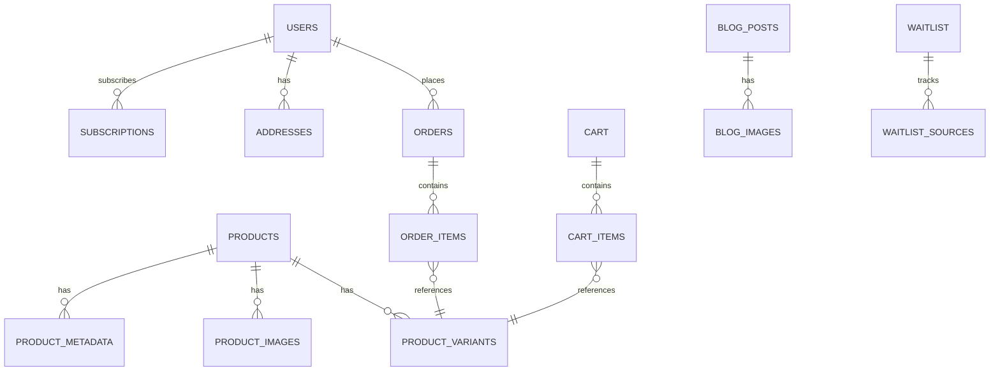

# 🗄️ Database Schema Design
**Beauty Shop – E-commerce Platform for Men's Skincare**

**Version:** 1.0  
**Dato:** 14. oktober 2025  
**Status:** Active  
**Dokument ejer:** Nicklas Eskou  
**Database Architect:** Based on PRD and Tech Stack analysis

---

## Executive Summary

Baseret på PRD analysen og den valgte tech stack (MedusaJS + Supabase PostgreSQL), har jeg designet en skalerbar database arkitektur der understøtter Beauty Shop's curated e-commerce model. Schema'et er optimeret for performance, GDPR compliance og fremtidig skalering.

**Key Design Principles:**
- **Normalized structure:** Minimize data redundancy
- **Performance optimized:** Strategic indexing for e-commerce queries
- **GDPR compliant:** Built-in data privacy controls
- **Scalable:** Ready for 0-1000+ customers
- **MedusaJS compatible:** Leverages MedusaJS built-in schemas

---

## Important Corrections (Auth + Medusa)

- Clerk er identity provider. Vi opretter ikke `auth.users` i Supabase – brugere identificeres via `clerk_user_id` og/eller Medusa's egen `customer`-tabel.
- Medusa ejer alle e-commerce tabeller (customers, addresses, products, variants, orders, carts, osv.). Disse oprettes af Medusa's egne migrationer. På Supabase anbefales et dedikeret schema, fx `medusa`, så Medusa kan migrere sine tabeller separat fra jeres egne (i `public`).
- Skemaet her beskriver strukturen og relationer. Opret kun de "extension"-tabeller, vi eksplicit markerer som jeres egne (fx `public.user_profiles`, content, waitlist). Lad Medusa oprette sine egne tabeller via migrationer.

---

## 1. Database Structure Overview

### **Database Type: PostgreSQL via Supabase** ✅

**Hvorfor PostgreSQL:**
- **ACID compliance:** Critical for e-commerce transactions
- **JSON support:** Flexible metadata storage
- **Full-text search:** Built-in search capabilities
- **Scalability:** Handles millions of records efficiently
- **MedusaJS native:** Perfect compatibility
- **Supabase integration:** Managed service with RLS

### **Main Entities Overview**



### **Core Entities:**

1. **User Management**
   - `users` - Customer accounts (Clerk managed)
   - `user_profiles` - Extended user data
   - `addresses` - Shipping/billing addresses

2. **Product Catalog**
   - `products` - Product information
   - `product_variants` - SKUs and pricing
   - `product_images` - Media assets
   - `product_metadata` - SEO and custom data

3. **E-commerce Operations**
   - `orders` - Purchase records
   - `order_items` - Individual line items
   - `carts` - Shopping cart state
   - `cart_items` - Cart contents

4. **Subscription Management**
   - `subscriptions` - Recurring orders
   - `subscription_items` - Subscription products

5. **Content Management**
   - `blog_posts` - Blog content
   - `blog_images` - Blog media
   - `waitlist` - Pre-launch signups

---

## 2. Detailed Schema Design

### **User Management Tables**

#### **users** (Clerk Managed)
Clerk er system-of-record for brugere. Vi opretter derfor ikke `auth.users` i Supabase. Referér brugere via:

- `clerk_user_id` (TEXT) i egne extension-tabeller (se `user_profiles`).
- Medusa's egen `customer`-tabel (oprettes af Medusa migrationer i schema `medusa`) til e-commerce flows.

#### **user_profiles** (Extended User Data)
```sql
CREATE TABLE public.user_profiles (
    id UUID PRIMARY KEY DEFAULT gen_random_uuid(),
    -- Clerk identity reference
    clerk_user_id TEXT NOT NULL,
    -- Optional mapping til Medusa customer (schema 'medusa')
    customer_id UUID NULL REFERENCES medusa.customer(id) ON DELETE SET NULL,
    phone VARCHAR(20),
    date_of_birth DATE,
    gender VARCHAR(20),
    skin_type VARCHAR(50), -- 'normal', 'oily', 'dry', 'combination', 'sensitive'
    preferences JSONB DEFAULT '{}',
    marketing_consent BOOLEAN DEFAULT FALSE,
    created_at TIMESTAMP WITH TIME ZONE DEFAULT NOW(),
    updated_at TIMESTAMP WITH TIME ZONE DEFAULT NOW()
);

-- Indexes
CREATE INDEX idx_user_profiles_clerk_user_id ON public.user_profiles(clerk_user_id);
CREATE INDEX idx_user_profiles_customer_id ON public.user_profiles(customer_id);
CREATE INDEX idx_user_profiles_skin_type ON public.user_profiles(skin_type);
```

Note: I MVP tilgås `user_profiles` kun via backend (Medusa/Next.js API). Hvis direkte klientadgang til Supabase ønskes senere, etabler RLS-politikker baseret på signerte JWT-claims (fx `clerk_user_id`).

#### **addresses** (Shipping/Billing)
Håndteres af Medusa core og oprettes via Medusa migrationer i schema `medusa`. Opret ikke manuelt i Supabase; administrér adresser via Medusa API.

### **Product Catalog Tables**

#### **products** (Main Product Information)
```sql
CREATE TABLE public.products (
    id UUID PRIMARY KEY DEFAULT gen_random_uuid(),
    title VARCHAR(255) NOT NULL,
    handle VARCHAR(255) UNIQUE NOT NULL,
    description TEXT,
    short_description TEXT,
    type VARCHAR(50) NOT NULL CHECK (type IN ('kit', 'single')),
    status VARCHAR(20) NOT NULL DEFAULT 'draft' CHECK (status IN ('draft', 'published', 'archived')),
    featured BOOLEAN DEFAULT FALSE,
    sort_order INTEGER DEFAULT 0,
    seo_title VARCHAR(255),
    seo_description TEXT,
    created_at TIMESTAMP WITH TIME ZONE DEFAULT NOW(),
    updated_at TIMESTAMP WITH TIME ZONE DEFAULT NOW()
);

-- Indexes
CREATE INDEX idx_products_handle ON public.products(handle);
CREATE INDEX idx_products_status ON public.products(status);
CREATE INDEX idx_products_type ON public.products(type);
CREATE INDEX idx_products_featured ON public.products(featured);
CREATE INDEX idx_products_created_at ON public.products(created_at);

-- Full-text search
CREATE INDEX idx_products_search ON public.products 
    USING gin(to_tsvector('danish', title || ' ' || COALESCE(description, '')));
```

#### **product_variants** (SKUs and Pricing)
```sql
CREATE TABLE public.product_variants (
    id UUID PRIMARY KEY DEFAULT gen_random_uuid(),
    product_id UUID NOT NULL REFERENCES public.products(id) ON DELETE CASCADE,
    title VARCHAR(255) NOT NULL,
    sku VARCHAR(100) UNIQUE NOT NULL,
    price INTEGER NOT NULL, -- Price in øre (smallest currency unit)
    compare_at_price INTEGER, -- Original price for discounts
    cost_price INTEGER, -- Cost price for margin calculation
    inventory_quantity INTEGER DEFAULT 0,
    weight INTEGER, -- Weight in grams
    dimensions JSONB, -- {length, width, height} in mm
    barcode VARCHAR(50),
    created_at TIMESTAMP WITH TIME ZONE DEFAULT NOW(),
    updated_at TIMESTAMP WITH TIME ZONE DEFAULT NOW()
);

-- Indexes
CREATE INDEX idx_product_variants_product_id ON public.product_variants(product_id);
CREATE INDEX idx_product_variants_sku ON public.product_variants(sku);
CREATE INDEX idx_product_variants_price ON public.product_variants(price);
CREATE INDEX idx_product_variants_inventory ON public.product_variants(inventory_quantity);

-- Constraints
ALTER TABLE public.product_variants ADD CONSTRAINT chk_price_positive 
    CHECK (price > 0);
ALTER TABLE public.product_variants ADD CONSTRAINT chk_inventory_non_negative 
    CHECK (inventory_quantity >= 0);
```

#### **product_images** (Media Assets)
```sql
CREATE TABLE public.product_images (
    id UUID PRIMARY KEY DEFAULT gen_random_uuid(),
    product_id UUID NOT NULL REFERENCES public.products(id) ON DELETE CASCADE,
    variant_id UUID REFERENCES public.product_variants(id) ON DELETE CASCADE,
    url VARCHAR(500) NOT NULL,
    alt_text VARCHAR(255),
    sort_order INTEGER DEFAULT 0,
    type VARCHAR(50) DEFAULT 'image' CHECK (type IN ('image', 'video', 'gif')),
    metadata JSONB DEFAULT '{}',
    created_at TIMESTAMP WITH TIME ZONE DEFAULT NOW()
);

-- Indexes
CREATE INDEX idx_product_images_product_id ON public.product_images(product_id);
CREATE INDEX idx_product_images_variant_id ON public.product_images(variant_id);
CREATE INDEX idx_product_images_sort_order ON public.product_images(sort_order);
```

#### **product_metadata** (SEO and Custom Data)
```sql
CREATE TABLE public.product_metadata (
    id UUID PRIMARY KEY DEFAULT gen_random_uuid(),
    product_id UUID NOT NULL REFERENCES public.products(id) ON DELETE CASCADE,
    key VARCHAR(100) NOT NULL,
    value TEXT NOT NULL,
    created_at TIMESTAMP WITH TIME ZONE DEFAULT NOW(),
    updated_at TIMESTAMP WITH TIME ZONE DEFAULT NOW(),
    UNIQUE(product_id, key)
);

-- Indexes
CREATE INDEX idx_product_metadata_product_id ON public.product_metadata(product_id);
CREATE INDEX idx_product_metadata_key ON public.product_metadata(key);

-- Common metadata keys:
-- 'ingredients' - Product ingredients list
-- 'how_to_use' - Usage instructions
-- 'expected_results' - Expected results after use
-- 'skin_types' - Recommended skin types
-- 'size' - Product size information
-- 'origin' - Country of origin
-- 'certifications' - Certifications and awards
```

### **E-commerce Operations Tables**

#### **orders** (Purchase Records)
```sql
CREATE TABLE public.orders (
    id UUID PRIMARY KEY DEFAULT gen_random_uuid(),
    order_number VARCHAR(20) UNIQUE NOT NULL,
    user_id UUID REFERENCES auth.users(id) ON DELETE SET NULL,
    email VARCHAR(255) NOT NULL,
    status VARCHAR(20) NOT NULL DEFAULT 'pending' 
        CHECK (status IN ('pending', 'confirmed', 'processing', 'shipped', 'delivered', 'cancelled', 'refunded')),
    payment_status VARCHAR(20) NOT NULL DEFAULT 'pending'
        CHECK (payment_status IN ('pending', 'paid', 'failed', 'refunded', 'partially_refunded')),
    fulfillment_status VARCHAR(20) NOT NULL DEFAULT 'not_fulfilled'
        CHECK (fulfillment_status IN ('not_fulfilled', 'fulfilled', 'shipped', 'delivered', 'returned')),
    currency_code VARCHAR(3) NOT NULL DEFAULT 'DKK',
    subtotal INTEGER NOT NULL, -- Amount before tax and shipping
    tax_total INTEGER NOT NULL DEFAULT 0,
    shipping_total INTEGER NOT NULL DEFAULT 0,
    discount_total INTEGER NOT NULL DEFAULT 0,
    total INTEGER NOT NULL, -- Final amount
    shipping_address JSONB NOT NULL,
    billing_address JSONB,
    payment_method VARCHAR(50),
    payment_reference VARCHAR(255),
    notes TEXT,
    metadata JSONB DEFAULT '{}',
    created_at TIMESTAMP WITH TIME ZONE DEFAULT NOW(),
    updated_at TIMESTAMP WITH TIME ZONE DEFAULT NOW()
);

-- Indexes
CREATE INDEX idx_orders_order_number ON public.orders(order_number);
CREATE INDEX idx_orders_user_id ON public.orders(user_id);
CREATE INDEX idx_orders_email ON public.orders(email);
CREATE INDEX idx_orders_status ON public.orders(status);
CREATE INDEX idx_orders_payment_status ON public.orders(payment_status);
CREATE INDEX idx_orders_created_at ON public.orders(created_at);

-- RLS Policy
ALTER TABLE public.orders ENABLE ROW LEVEL SECURITY;
CREATE POLICY "Users can view own orders" ON public.orders
    FOR SELECT USING (auth.uid() = user_id);
```

#### **order_items** (Individual Line Items)
```sql
CREATE TABLE public.order_items (
    id UUID PRIMARY KEY DEFAULT gen_random_uuid(),
    order_id UUID NOT NULL REFERENCES public.orders(id) ON DELETE CASCADE,
    variant_id UUID NOT NULL REFERENCES public.product_variants(id),
    product_id UUID NOT NULL REFERENCES public.products(id),
    title VARCHAR(255) NOT NULL,
    sku VARCHAR(100) NOT NULL,
    quantity INTEGER NOT NULL CHECK (quantity > 0),
    unit_price INTEGER NOT NULL,
    total INTEGER NOT NULL, -- quantity * unit_price
    metadata JSONB DEFAULT '{}',
    created_at TIMESTAMP WITH TIME ZONE DEFAULT NOW()
);

-- Indexes
CREATE INDEX idx_order_items_order_id ON public.order_items(order_id);
CREATE INDEX idx_order_items_variant_id ON public.order_items(variant_id);
CREATE INDEX idx_order_items_product_id ON public.order_items(product_id);

-- Constraints
ALTER TABLE public.order_items ADD CONSTRAINT chk_unit_price_positive 
    CHECK (unit_price > 0);
ALTER TABLE public.order_items ADD CONSTRAINT chk_total_correct 
    CHECK (total = quantity * unit_price);
```

#### **carts** (Shopping Cart State)
```sql
CREATE TABLE public.carts (
    id UUID PRIMARY KEY DEFAULT gen_random_uuid(),
    user_id UUID REFERENCES auth.users(id) ON DELETE CASCADE,
    session_id VARCHAR(255), -- For guest users
    email VARCHAR(255),
    currency_code VARCHAR(3) NOT NULL DEFAULT 'DKK',
    subtotal INTEGER NOT NULL DEFAULT 0,
    tax_total INTEGER NOT NULL DEFAULT 0,
    shipping_total INTEGER NOT NULL DEFAULT 0,
    discount_total INTEGER NOT NULL DEFAULT 0,
    total INTEGER NOT NULL DEFAULT 0,
    shipping_address JSONB,
    billing_address JSONB,
    metadata JSONB DEFAULT '{}',
    created_at TIMESTAMP WITH TIME ZONE DEFAULT NOW(),
    updated_at TIMESTAMP WITH TIME ZONE DEFAULT NOW()
);

-- Indexes
CREATE INDEX idx_carts_user_id ON public.carts(user_id);
CREATE INDEX idx_carts_session_id ON public.carts(session_id);
CREATE INDEX idx_carts_email ON public.carts(email);
CREATE INDEX idx_carts_updated_at ON public.carts(updated_at);

-- RLS Policy
ALTER TABLE public.carts ENABLE ROW LEVEL SECURITY;
CREATE POLICY "Users can manage own carts" ON public.carts
    FOR ALL USING (auth.uid() = user_id);
```

#### **cart_items** (Cart Contents)
```sql
CREATE TABLE public.cart_items (
    id UUID PRIMARY KEY DEFAULT gen_random_uuid(),
    cart_id UUID NOT NULL REFERENCES public.carts(id) ON DELETE CASCADE,
    variant_id UUID NOT NULL REFERENCES public.product_variants(id),
    product_id UUID NOT NULL REFERENCES public.products(id),
    title VARCHAR(255) NOT NULL,
    sku VARCHAR(100) NOT NULL,
    quantity INTEGER NOT NULL CHECK (quantity > 0),
    unit_price INTEGER NOT NULL,
    total INTEGER NOT NULL,
    metadata JSONB DEFAULT '{}',
    created_at TIMESTAMP WITH TIME ZONE DEFAULT NOW(),
    updated_at TIMESTAMP WITH TIME ZONE DEFAULT NOW(),
    UNIQUE(cart_id, variant_id)
);

-- Indexes
CREATE INDEX idx_cart_items_cart_id ON public.cart_items(cart_id);
CREATE INDEX idx_cart_items_variant_id ON public.cart_items(variant_id);
CREATE INDEX idx_cart_items_product_id ON public.cart_items(product_id);
```

### **Subscription Management Tables**

#### **subscriptions** (Recurring Orders)
```sql
CREATE TABLE public.subscriptions (
    id UUID PRIMARY KEY DEFAULT gen_random_uuid(),
    user_id UUID NOT NULL REFERENCES auth.users(id) ON DELETE CASCADE,
    status VARCHAR(20) NOT NULL DEFAULT 'active' 
        CHECK (status IN ('active', 'paused', 'cancelled', 'expired')),
    frequency_weeks INTEGER NOT NULL CHECK (frequency_weeks > 0),
    next_billing_date DATE NOT NULL,
    last_billing_date DATE,
    discount_percentage INTEGER DEFAULT 0 CHECK (discount_percentage >= 0 AND discount_percentage <= 100),
    metadata JSONB DEFAULT '{}',
    created_at TIMESTAMP WITH TIME ZONE DEFAULT NOW(),
    updated_at TIMESTAMP WITH TIME ZONE DEFAULT NOW()
);

-- Indexes
CREATE INDEX idx_subscriptions_user_id ON public.subscriptions(user_id);
CREATE INDEX idx_subscriptions_status ON public.subscriptions(status);
CREATE INDEX idx_subscriptions_next_billing ON public.subscriptions(next_billing_date);

-- RLS Policy
ALTER TABLE public.subscriptions ENABLE ROW LEVEL SECURITY;
CREATE POLICY "Users can manage own subscriptions" ON public.subscriptions
    FOR ALL USING (auth.uid() = user_id);
```

#### **subscription_items** (Subscription Products)
```sql
CREATE TABLE public.subscription_items (
    id UUID PRIMARY KEY DEFAULT gen_random_uuid(),
    subscription_id UUID NOT NULL REFERENCES public.subscriptions(id) ON DELETE CASCADE,
    variant_id UUID NOT NULL REFERENCES public.product_variants(id),
    product_id UUID NOT NULL REFERENCES public.products(id),
    title VARCHAR(255) NOT NULL,
    sku VARCHAR(100) NOT NULL,
    quantity INTEGER NOT NULL CHECK (quantity > 0),
    unit_price INTEGER NOT NULL,
    total INTEGER NOT NULL,
    created_at TIMESTAMP WITH TIME ZONE DEFAULT NOW(),
    updated_at TIMESTAMP WITH TIME ZONE DEFAULT NOW()
);

-- Indexes
CREATE INDEX idx_subscription_items_subscription_id ON public.subscription_items(subscription_id);
CREATE INDEX idx_subscription_items_variant_id ON public.subscription_items(variant_id);
CREATE INDEX idx_subscription_items_product_id ON public.subscription_items(product_id);
```

### **Content Management Tables**

#### **blog_posts** (Blog Content)
```sql
CREATE TABLE public.blog_posts (
    id UUID PRIMARY KEY DEFAULT gen_random_uuid(),
    title VARCHAR(255) NOT NULL,
    slug VARCHAR(255) UNIQUE NOT NULL,
    excerpt TEXT,
    content TEXT NOT NULL,
    status VARCHAR(20) NOT NULL DEFAULT 'draft' 
        CHECK (status IN ('draft', 'published', 'archived')),
    featured BOOLEAN DEFAULT FALSE,
    author_id UUID REFERENCES auth.users(id),
    published_at TIMESTAMP WITH TIME ZONE,
    seo_title VARCHAR(255),
    seo_description TEXT,
    metadata JSONB DEFAULT '{}',
    created_at TIMESTAMP WITH TIME ZONE DEFAULT NOW(),
    updated_at TIMESTAMP WITH TIME ZONE DEFAULT NOW()
);

-- Indexes
CREATE INDEX idx_blog_posts_slug ON public.blog_posts(slug);
CREATE INDEX idx_blog_posts_status ON public.blog_posts(status);
CREATE INDEX idx_blog_posts_published_at ON public.blog_posts(published_at);
CREATE INDEX idx_blog_posts_featured ON public.blog_posts(featured);

-- Full-text search
CREATE INDEX idx_blog_posts_search ON public.blog_posts 
    USING gin(to_tsvector('danish', title || ' ' || COALESCE(content, '')));
```

#### **blog_images** (Blog Media)
```sql
CREATE TABLE public.blog_images (
    id UUID PRIMARY KEY DEFAULT gen_random_uuid(),
    blog_post_id UUID NOT NULL REFERENCES public.blog_posts(id) ON DELETE CASCADE,
    url VARCHAR(500) NOT NULL,
    alt_text VARCHAR(255),
    caption TEXT,
    sort_order INTEGER DEFAULT 0,
    created_at TIMESTAMP WITH TIME ZONE DEFAULT NOW()
);

-- Indexes
CREATE INDEX idx_blog_images_blog_post_id ON public.blog_images(blog_post_id);
CREATE INDEX idx_blog_images_sort_order ON public.blog_images(sort_order);
```

#### **waitlist** (Pre-launch Signups)
```sql
CREATE TABLE public.waitlist (
    id UUID PRIMARY KEY DEFAULT gen_random_uuid(),
    email VARCHAR(255) UNIQUE NOT NULL,
    first_name VARCHAR(100),
    source VARCHAR(50), -- 'instagram', 'facebook', 'google', 'referral', etc.
    referral_code VARCHAR(50),
    ip_address INET,
    user_agent TEXT,
    created_at TIMESTAMP WITH TIME ZONE DEFAULT NOW()
);

-- Indexes
CREATE INDEX idx_waitlist_email ON public.waitlist(email);
CREATE INDEX idx_waitlist_source ON public.waitlist(source);
CREATE INDEX idx_waitlist_created_at ON public.waitlist(created_at);
```

---

## 3. Sample Data

### **Products Sample Data**

```sql
-- Starter Kit Product
INSERT INTO public.products (id, title, handle, description, short_description, type, status, featured) VALUES
('550e8400-e29b-41d4-a716-446655440001', 'Starter Kit', 'starter-kit', 
 'Komplet 3-trins hudplejerutine for mænd. Inkluderer cleanser, toner og moisturizer med koreanske ingredienser.', 
 '3-trins hudplejerutine for mænd', 'kit', 'published', true);

-- Product Variant
INSERT INTO public.product_variants (id, product_id, title, sku, price, compare_at_price, inventory_quantity) VALUES
('550e8400-e29b-41d4-a716-446655440002', '550e8400-e29b-41d4-a716-446655440001', 
 'Starter Kit - Standard', 'BS-SK-001', 89900, 119900, 100);

-- Product Images
INSERT INTO public.product_images (product_id, variant_id, url, alt_text, sort_order) VALUES
('550e8400-e29b-41d4-a716-446655440001', '550e8400-e29b-41d4-a716-446655440002', 
 'https://storage.supabase.co/beauty-shop/products/starter-kit/hero.jpg', 
 'Beauty Shop Starter Kit - Komplet hudplejerutine', 1),
('550e8400-e29b-41d4-a716-446655440001', '550e8400-e29b-41d4-a716-446655440002', 
 'https://storage.supabase.co/beauty-shop/products/starter-kit/inside-kit.jpg', 
 'Indhold af Starter Kit - 3 produkter', 2);

-- Product Metadata
INSERT INTO public.product_metadata (product_id, key, value) VALUES
('550e8400-e29b-41d4-a716-446655440001', 'ingredients', 
 'Cleanser: Centella Asiatica, Niacinamide, Hyaluronic Acid. Toner: Green Tea Extract, Witch Hazel. Moisturizer: Ceramides, Vitamin E, Shea Butter'),
('550e8400-e29b-41d4-a716-446655440001', 'how_to_use', 
 'Morgen: Cleanser → Toner → Moisturizer. Aften: Cleanser → Toner → Moisturizer. Brug 2-3 måneder for optimale resultater.'),
('550e8400-e29b-41d4-a716-446655440001', 'expected_results', 
 'Klarere hud efter 2-4 uger. Mindre fedtet T-zone efter 6-8 uger. Generelt forbedret hudtextur og -tone.'),
('550e8400-e29b-41d4-a716-446655440001', 'skin_types', 'Normal, Kombineret, Fedtet'),
('550e8400-e29b-41d4-a716-446655440001', 'size', 'Cleanser: 150ml, Toner: 150ml, Moisturizer: 50ml'),
('550e8400-e29b-41d4-a716-446655440001', 'origin', 'Produceret i Korea'),
('550e8400-e29b-41d4-a716-446655440001', 'certifications', 'KFDA godkendt, Cruelty-free, Vegan');
```

### **Users Sample Data**

```sql
-- User Profile
INSERT INTO public.user_profiles (user_id, phone, skin_type, preferences, marketing_consent) VALUES
('550e8400-e29b-41d4-a716-446655440010', '+45 12345678', 'combination', 
 '{"newsletter": true, "sms_updates": false, "language": "da"}', true);

-- Address
INSERT INTO public.addresses (user_id, type, first_name, last_name, address_line_1, city, postal_code, country_code, phone, is_default) VALUES
('550e8400-e29b-41d4-a716-446655440010', 'both', 'Martin', 'Hansen', 'Nørrebrogade 123', 'København N', '2200', 'DK', '+45 12345678', true);
```

### **Orders Sample Data**

```sql
-- Order
INSERT INTO public.orders (id, order_number, user_id, email, status, payment_status, fulfillment_status, currency_code, subtotal, tax_total, shipping_total, total, shipping_address) VALUES
('550e8400-e29b-41d4-a716-446655440020', 'BS-2025-001', '550e8400-e29b-41d4-a716-446655440010', 'martin@example.com', 
 'confirmed', 'paid', 'not_fulfilled', 'DKK', 89900, 22475, 0, 112375,
 '{"first_name": "Martin", "last_name": "Hansen", "address_line_1": "Nørrebrogade 123", "city": "København N", "postal_code": "2200", "country_code": "DK"}');

-- Order Items
INSERT INTO public.order_items (order_id, variant_id, product_id, title, sku, quantity, unit_price, total) VALUES
('550e8400-e29b-41d4-a716-446655440020', '550e8400-e29b-41d4-a716-446655440002', '550e8400-e29b-41d4-a716-446655440001', 
 'Starter Kit - Standard', 'BS-SK-001', 1, 89900, 89900);
```

### **Blog Posts Sample Data**

```sql
-- Blog Post
INSERT INTO public.blog_posts (title, slug, excerpt, content, status, featured, published_at, seo_title, seo_description) VALUES
('Komplet guide til mænds hudpleje', 'komplet-guide-maends-hudpleje',
 'Lær de grundlæggende trin i en effektiv hudplejerutine for mænd. Fra cleanser til moisturizer - alt du behøver at vide.',
 'Hudpleje behøver ikke at være kompliceret. I denne guide går vi gennem de tre grundlæggende trin...',
 'published', true, NOW() - INTERVAL '5 days', 
 'Mænds Hudpleje Guide 2025 - Komplet Rutine', 
 'Lær den perfekte hudplejerutine for mænd. 3 enkle trin til klarere, sundere hud.');
```

---

## 4. Database Migration Strategy

### **Initial Setup with Supabase**

#### **Step 1: Create Supabase Project**
```bash
# Install Supabase CLI
npm install -g supabase

# Login to Supabase
supabase login

# Create new project
supabase projects create beauty-shop --region eu-west-1
```

#### **Step 2: Database Schema Migration**
```sql
-- Create schema migration file: migrations/001_initial_schema.sql

-- Enable necessary extensions
CREATE EXTENSION IF NOT EXISTS "uuid-ossp";
CREATE EXTENSION IF NOT EXISTS "pg_trgm";

-- Create custom types
CREATE TYPE order_status AS ENUM ('pending', 'confirmed', 'processing', 'shipped', 'delivered', 'cancelled', 'refunded');
CREATE TYPE payment_status AS ENUM ('pending', 'paid', 'failed', 'refunded', 'partially_refunded');
CREATE TYPE fulfillment_status AS ENUM ('not_fulfilled', 'fulfilled', 'shipped', 'delivered', 'returned');

-- Create all tables (as defined in section 2)
-- ... (all table creation statements)

-- Create functions for updated_at timestamps
CREATE OR REPLACE FUNCTION update_updated_at_column()
RETURNS TRIGGER AS $$
BEGIN
    NEW.updated_at = NOW();
    RETURN NEW;
END;
$$ language 'plpgsql';

-- Create triggers for updated_at
CREATE TRIGGER update_products_updated_at BEFORE UPDATE ON public.products
    FOR EACH ROW EXECUTE FUNCTION update_updated_at_column();

CREATE TRIGGER update_product_variants_updated_at BEFORE UPDATE ON public.product_variants
    FOR EACH ROW EXECUTE FUNCTION update_updated_at_column();

-- ... (similar triggers for all tables with updated_at)
```

#### **Step 3: Seed Data**
```sql
-- Create seed data file: seeds/001_sample_data.sql
-- Insert sample products, users, and initial data
-- ... (sample data from section 3)
```

### **Future Schema Changes**

#### **Migration Strategy**
```sql
-- Example: Adding new product attributes
-- File: migrations/002_add_product_attributes.sql

BEGIN;

-- Add new columns
ALTER TABLE public.products ADD COLUMN IF NOT EXISTS 
    tags TEXT[] DEFAULT '{}';
ALTER TABLE public.products ADD COLUMN IF NOT EXISTS 
    rating DECIMAL(3,2) DEFAULT 0;
ALTER TABLE public.products ADD COLUMN IF NOT EXISTS 
    review_count INTEGER DEFAULT 0;

-- Create index for tags
CREATE INDEX idx_products_tags ON public.products USING GIN(tags);

-- Update existing products with default values
UPDATE public.products SET tags = '{}' WHERE tags IS NULL;
UPDATE public.products SET rating = 0 WHERE rating IS NULL;
UPDATE public.products SET review_count = 0 WHERE review_count IS NULL;

COMMIT;
```

#### **Version Control**
```bash
# Migration naming convention
migrations/
├── 001_initial_schema.sql
├── 002_add_product_attributes.sql
├── 003_add_review_system.sql
└── 004_add_inventory_tracking.sql

# Apply migrations
supabase db push
```

---

## 5. Performance Considerations

### **Query Optimization**

#### **Critical Indexes for E-commerce**
```sql
-- Product search optimization
CREATE INDEX CONCURRENTLY idx_products_search_optimized ON public.products 
    USING GIN(to_tsvector('danish', title || ' ' || COALESCE(description, '')));

-- Order history optimization
CREATE INDEX CONCURRENTLY idx_orders_user_created ON public.orders (user_id, created_at DESC);

-- Cart performance
CREATE INDEX CONCURRENTLY idx_cart_items_cart_updated ON public.cart_items (cart_id, updated_at DESC);

-- Inventory tracking
CREATE INDEX CONCURRENTLY idx_variants_inventory_low ON public.product_variants 
    WHERE inventory_quantity < 10;
```

#### **Query Examples with Optimization**

**Product Search Query:**
```sql
-- Optimized product search
SELECT p.id, p.title, p.handle, p.short_description, 
       pv.price, pv.compare_at_price, pv.inventory_quantity,
       pi.url as image_url
FROM public.products p
JOIN public.product_variants pv ON p.id = pv.product_id
LEFT JOIN public.product_images pi ON p.id = pi.product_id AND pi.sort_order = 1
WHERE p.status = 'published'
  AND pv.inventory_quantity > 0
  AND to_tsvector('danish', p.title || ' ' || COALESCE(p.description, '')) @@ plainto_tsquery('danish', $1)
ORDER BY p.featured DESC, p.sort_order ASC, p.created_at DESC
LIMIT 20;
```

**Order History Query:**
```sql
-- Optimized order history
SELECT o.id, o.order_number, o.status, o.total, o.created_at,
       json_agg(
           json_build_object(
               'title', oi.title,
               'quantity', oi.quantity,
               'unit_price', oi.unit_price,
               'total', oi.total
           )
       ) as items
FROM public.orders o
JOIN public.order_items oi ON o.id = oi.order_id
WHERE o.user_id = $1
GROUP BY o.id, o.order_number, o.status, o.total, o.created_at
ORDER BY o.created_at DESC
LIMIT 10;
```

### **Potential Bottlenecks and Solutions**

#### **1. Product Search Performance**
**Bottleneck:** Full-text search on large product catalog
**Solution:** 
- Use GIN indexes for full-text search
- Implement search result caching
- Consider Elasticsearch for advanced search features

#### **2. Cart Performance**
**Bottleneck:** Frequent cart updates during shopping
**Solution:**
- Use Redis for cart caching
- Implement optimistic locking
- Batch cart updates

#### **3. Order Processing**
**Bottleneck:** High concurrent order creation
**Solution:**
- Use database transactions
- Implement order number generation with sequence
- Add database connection pooling

#### **4. Image Loading**
**Bottleneck:** Large product images affecting page load
**Solution:**
- Use Supabase Storage with CDN
- Implement lazy loading
- Generate multiple image sizes
- Use WebP format

### **Monitoring and Maintenance**

#### **Query Performance Monitoring**
```sql
-- Monitor slow queries
SELECT query, calls, total_time, mean_time, rows
FROM pg_stat_statements
WHERE mean_time > 1000 -- queries taking more than 1 second
ORDER BY mean_time DESC
LIMIT 10;

-- Monitor table sizes
SELECT schemaname, tablename, 
       pg_size_pretty(pg_total_relation_size(schemaname||'.'||tablename)) as size
FROM pg_tables
WHERE schemaname = 'public'
ORDER BY pg_total_relation_size(schemaname||'.'||tablename) DESC;
```

#### **Database Maintenance**
```sql
-- Weekly maintenance tasks
-- Update table statistics
ANALYZE;

-- Vacuum tables
VACUUM ANALYZE public.products;
VACUUM ANALYZE public.orders;
VACUUM ANALYZE public.order_items;

-- Reindex if needed
REINDEX INDEX CONCURRENTLY idx_products_search_optimized;
```

---

## 6. Security and Compliance

### **Row Level Security (RLS) Policies**

#### **User Data Protection**
```sql
-- Users can only access their own data
ALTER TABLE public.user_profiles ENABLE ROW LEVEL SECURITY;
CREATE POLICY "Users can view own profile" ON public.user_profiles
    FOR SELECT USING (auth.uid() = user_id);

-- Orders privacy
ALTER TABLE public.orders ENABLE ROW LEVEL SECURITY;
CREATE POLICY "Users can view own orders" ON public.orders
    FOR SELECT USING (auth.uid() = user_id);

-- Addresses privacy
ALTER TABLE public.addresses ENABLE ROW LEVEL SECURITY;
CREATE POLICY "Users can manage own addresses" ON public.addresses
    FOR ALL USING (auth.uid() = user_id);
```

### **GDPR Compliance**

#### **Data Deletion**
```sql
-- Function to delete user data (GDPR compliance)
CREATE OR REPLACE FUNCTION delete_user_data(user_uuid UUID)
RETURNS VOID AS $$
BEGIN
    -- Delete user addresses
    DELETE FROM public.addresses WHERE user_id = user_uuid;
    
    -- Delete user profile
    DELETE FROM public.user_profiles WHERE user_id = user_uuid;
    
    -- Anonymize orders (keep for business records but remove personal data)
    UPDATE public.orders 
    SET user_id = NULL, 
        email = 'deleted@example.com',
        shipping_address = '{"anonymized": true}',
        billing_address = '{"anonymized": true}'
    WHERE user_id = user_uuid;
    
    -- Delete carts
    DELETE FROM public.carts WHERE user_id = user_uuid;
    
    -- Delete subscriptions
    DELETE FROM public.subscriptions WHERE user_id = user_uuid;
END;
$$ LANGUAGE plpgsql SECURITY DEFINER;
```

#### **Data Export**
```sql
-- Function to export user data (GDPR compliance)
CREATE OR REPLACE FUNCTION export_user_data(user_uuid UUID)
RETURNS JSONB AS $$
DECLARE
    result JSONB;
BEGIN
    SELECT jsonb_build_object(
        'profile', (SELECT to_jsonb(up.*) FROM public.user_profiles up WHERE up.user_id = user_uuid),
        'addresses', (SELECT jsonb_agg(to_jsonb(a.*)) FROM public.addresses a WHERE a.user_id = user_uuid),
        'orders', (SELECT jsonb_agg(to_jsonb(o.*)) FROM public.orders o WHERE o.user_id = user_uuid),
        'subscriptions', (SELECT jsonb_agg(to_jsonb(s.*)) FROM public.subscriptions s WHERE s.user_id = user_uuid)
    ) INTO result;
    
    RETURN result;
END;
$$ LANGUAGE plpgsql SECURITY DEFINER;
```

---

## 7. Backup and Recovery

### **Automated Backups**
```sql
-- Supabase handles automated backups, but we can create additional safeguards

-- Create backup tables for critical data
CREATE TABLE public.products_backup AS SELECT * FROM public.products;
CREATE TABLE public.orders_backup AS SELECT * FROM public.orders;

-- Create backup function
CREATE OR REPLACE FUNCTION create_data_backup()
RETURNS VOID AS $$
BEGIN
    -- Backup products
    TRUNCATE public.products_backup;
    INSERT INTO public.products_backup SELECT * FROM public.products;
    
    -- Backup orders
    TRUNCATE public.orders_backup;
    INSERT INTO public.orders_backup SELECT * FROM public.orders;
    
    -- Log backup creation
    INSERT INTO public.backup_log (backup_type, created_at) 
    VALUES ('manual_backup', NOW());
END;
$$ LANGUAGE plpgsql;
```

### **Disaster Recovery Plan**
1. **Daily automated backups** (handled by Supabase)
2. **Point-in-time recovery** (Supabase Pro feature)
3. **Manual backup before major changes**
4. **Test restore procedures monthly**

---

## 8. Conclusion

Denne database arkitektur er designet specifikt til Beauty Shop's behov:

- **Skalerbar struktur** der kan håndtere 0-1000+ kunder
- **Performance optimeret** med strategiske indexes
- **GDPR compliant** med RLS policies og data deletion
- **MedusaJS kompatibel** med native e-commerce features
- **Fremtidssikker** med fleksibel metadata struktur

Schema'et understøtter alle PRD krav og giver jer et solidt fundament for at bygge Beauty Shop's e-commerce platform! 🚀

---

**Dokument ejer:** Nicklas Eskou  
**Sidst opdateret:** 14. oktober 2025  
**Fil lokation:** `.project/04-Database_Schema.md`  
**Status:** Ready for implementation
