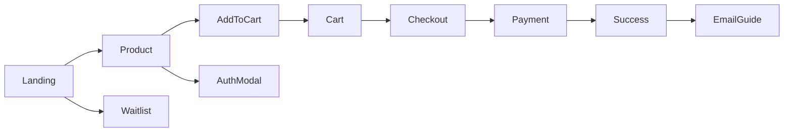

## 🧭 07 — Frontend Development Guide

**Version:** 1.0  
**Dato:** 19. oktober 2025  
**Status:** Klar til implementering  
**Dokumentejer:** Nicklas Eskou  
**Filplacering:** `.project/07-Frontend_Guide.md`

—

### Omfang
Dette dokument guider frontend‑udviklingen af Beauty Shop webappen fra opsætning til lancering. Det dækker teknisk implementering, UI/UX, faser, komponentspecifikationer, API‑integration, test og performance. Designfiler administreres i `.figma-design/` (Figma Makes).

—

## 1) Projektopsætning & Miljø

### 1.1 Framework og CLI
- **Framework:** Next.js 15 (App Router) + React 19 + TypeScript
- **Node:** v20 LTS

```bash
# Opret projekt
npx create-next-app@latest beauty-shop --typescript --tailwind --app

cd beauty-shop
```

### 1.2 Pakker og afhængigheder
- UI & styling: `tailwindcss`, `@tailwindcss/forms`, `@tailwindcss/typography`, `shadcn/ui` (Radix UI), `lucide-react`
- State: `zustand`
- Formularer & validering: `react-hook-form`, `zod`, `@hookform/resolvers`
- E‑commerce/SDKs: `@medusajs/medusa-js`, `@stripe/stripe-js`, `@clerk/nextjs`
- Observability: `@sentry/nextjs`
- Emails (post‑MVP): `resend`, `@react-email/components`
- Dev tooling: `eslint`, `prettier`, `husky`, `lint-staged`

```bash
npm install @medusajs/medusa-js @stripe/stripe-js @clerk/nextjs zustand \
  react-hook-form zod @hookform/resolvers lucide-react

npm install -D @sentry/nextjs eslint prettier husky lint-staged \
  @tailwindcss/forms @tailwindcss/typography
```

### 1.3 Tailwind & shadcn/ui
```bash
npx tailwindcss init -p
# shadcn/ui setup (vælg Next.js + Tailwind)
npx shadcn@latest init
```
Kortlæg Figma tokens → CSS variables i `styles/globals.css` (typografi, farver, spacing).

### 1.4 Miljøvariabler (.env.local)
- `NEXT_PUBLIC_API_URL` — Base til backend API (`/v1`), fx `https://api.beautyshop.com`
- `NEXT_PUBLIC_STRIPE_PUBLISHABLE_KEY`
- `CLERK_PUBLISHABLE_KEY`, `CLERK_SECRET_KEY`
- `NEXT_PUBLIC_SENTRY_DSN`
- `NEXT_PUBLIC_LAUNCHDARKLY_CLIENT_ID` (feature flags, post‑MVP)

### 1.5 Dev‑miljø og scripts
```json
{
  "scripts": {
    "dev": "next dev",
    "build": "next build",
    "start": "next start -p 3000",
    "lint": "next lint",
    "type-check": "tsc --noEmit"
  }
}
```

### 1.6 Integration med backend API’er
- Offentlige endpoints: produkter, venteliste (se `05-API_Design.md`)
- Beskyttede endpoints: mine ordrer, profil (Clerk JWT i `Authorization`)
- SSR/ISR: brug `fetch(..., { next: { revalidate: 60 } })` til katalog og produktsider

```ts
// app/(store)/page.tsx — SSR produktliste
export default async function Home() {
  const res = await fetch(`${process.env.NEXT_PUBLIC_API_URL}/v1/products?include=images,variants&limit=12`, {
    next: { revalidate: 60 }
  })
  const data = await res.json()
  return <ProductGrid products={data.items} />
}
```

—

## 2) UI/UX Planlægning

### 2.1 Figma og filstruktur
- Alle UI/UX‑assets i `.figma-design/` (synk til Figma Makes).  
- Filer: `foundation-tokens.fig`, `components.fig`, `pages.fig`, `prototypes.fig`
- Naming: `BS/Component/Variant` (fx `BS/Button/Primary`)

### 2.2 Wireframes (beskrivelse)
- Landing: Hero (value prop), 3‑trins ritual, social proof, email capture
- Produkt (Starter Kit): galleri, "Inside the Kit", ingredienser (expand), how‑to, add‑to‑cart (sticky på mobil)
- Kurv: liste, qty, pris, subtotal/total, CTA til checkout
- Checkout: adresse, fragt, betaling (Stripe), kvittering
- Auth: modal til login/signup, social logins
- Konto: ordreoversigt, ordre‑detaljer

### 2.3 Brugerflow (mermaid)


### 2.4 Komponenthierarki (uddrag)
- Layout: `Header`, `Footer`, `MobileNav`, `ToastProvider`
- Landing: `Hero`, `ThreeStepRitual`, `SocialProof`, `EmailSignup`
- Produkt: `ProductGallery`, `InsideTheKit`, `IngredientsAccordion`, `AddToCartBar`
- Kurv: `CartList`, `CartSummary`, `EmptyState`
- Checkout: `AddressForm`, `ShippingMethod`, `PaymentButton`
- Auth: `AuthDialog`, `LoginForm`, `SignupForm`
- Konto: `OrderList`, `OrderCard`, `OrderDetail`

### 2.5 Responsive design
- Breakpoints: `sm 640`, `md 768`, `lg 1024`, `xl 1280`
- Mobil først; sticky add‑to‑cart; store klikmål; læsbar typografi (16–18px base)
- Billedoptimering: `next/image`, WebP, `sizes` og `priority` kun for hero

—

## 3) Udviklingsfaser

### Fase 1: Grundstruktur & Navigation
**Mål:** Kørbar app, layout, navigation, landing med hero og sektioner.

— Komponentspecifikationer
- `app/layout.tsx`: global `<ClerkProvider/>`, Sentry init, `ToastProvider`
- `Header` (logo, nav, cart‑badge), `Footer` (links), `MobileNav`
- Landing sektioner: `Hero`, `ThreeStepRitual`, `EmailSignup`

— Opgaver (trin‑for‑trin)
1) Opsæt Tailwind, shadcn/ui, farve‑tokens fra Figma
2) Implementér layout + navigation (desktop/mobil)
3) Landing page (statisk copy, placeholder billeder)

— Kodeeksempel (layout)
```tsx
// app/layout.tsx
import { ClerkProvider } from '@clerk/nextjs'
import './globals.css'

export default function RootLayout({ children }: { children: React.ReactNode }) {
  return (
    <ClerkProvider>
      <html lang="da">
        <body className="min-h-dvh bg-warmwhite text-charcoal">
          <Header />
          <main>{children}</main>
          <Footer />
          <ToastProvider />
        </body>
      </html>
    </ClerkProvider>
  )
}
```

— API‑integration
- Landing kan hente produktcount/social proof senere; i Fase 1 statisk content

— Test‑checkpoints
- Lighthouse: Performance/Accessibility 90+
- Responsive i Chrome devtools (iPhone SE → Desktop)

### Fase 2: Authentication UI & Brugerstyring
**Mål:** Login/Signup modaler, guest‑checkout flow intakt.

— Komponenter
- `AuthDialog`, `LoginForm`, `SignupForm`, `UserMenu`

— Opgaver
1) Konfigurer Clerk i Next.js (env keys, middleware ved behov)
2) Modaler for login/signup (Google/Apple knapper)
3) `UserMenu` (profil, ordrer, logout)

— Kodeeksempel (AuthDialog)
```tsx
// components/auth/AuthDialog.tsx
import { SignIn } from '@clerk/nextjs'
export function AuthDialog() {
  return (
    <div className="max-w-md mx-auto">
      <SignIn appearance={{ variables: { colorPrimary: '#7A5640' } }} />
    </div>
  )
}
```

— API‑integration
- Beskyttet: `/v1/customers/me`, `/v1/customers/me/orders` (Clerk JWT)

— Test‑checkpoints
- Social login virker (Google, evt. Apple)
- Guest flow forbliver tilgængelig (ingen auth‑tvang i checkout)

### Fase 3: Kernefunktioner (Katalog, Produkt, Kurv, Checkout)
**Mål:** Fuldt flow fra produkt → kurv → checkout → success (Stripe test).

— Komponenter
- Katalog: `ProductGrid`, `ProductCard`
- Produkt: `ProductGallery`, `InsideTheKit`, `AddToCartBar`
- Kurv: `CartList`, `CartSummary`
- Checkout: `AddressForm`, `ShippingMethod`, `PaymentButton`

— Opgaver
1) Katalog SSR med `GET /v1/products`
2) Produktdetalje med `GET /v1/products/handle/{handle}`
3) Kurv: create/get/add/update/remove via `/v1/carts*`
4) Adresse & fragt via `POST /v1/carts/{id}/shipping-address`
5) Stripe session via `POST /v1/carts/{id}/payment-sessions`
6) Complete order via `POST /v1/carts/{id}/complete`

— Kodeeksempler
```ts
// add to cart (client action)
export async function addToCart(cartId: string, variantId: string) {
  const r = await fetch(`${process.env.NEXT_PUBLIC_API_URL}/v1/carts/${cartId}/line-items`, {
    method: 'POST',
    headers: { 'Content-Type': 'application/json', 'Idempotency-Key': crypto.randomUUID() },
    body: JSON.stringify({ variantId, quantity: 1 })
  })
  if (!r.ok) throw new Error('Kunne ikke tilføje til kurv')
  return r.json()
}
```

— Test‑checkpoints
- Stripe testkort virker; ordre oprettes; success‑side viser ordrenummer
- Edge cases: udsolgt variant, netværksfejl (venlige fejlmeddelelser)

### Fase 4: Avancerede features & Polish
**Mål:** Inside‑the‑Kit UI, ingrediens‑accordion, gave‑tilstand, kontosider.

— Komponenter
- Produkt‑udvidelser: `IngredientsAccordion`, "Free‑from" badges
- Gave: `GiftToggle` (kurv), note (≤150 tegn)
- Konto: `OrderList`, `OrderDetail`

— Opgaver
1) Implementér gaveflow `POST /v1/carts/{id}/gift`
2) Konto → ordrer `GET /v1/customers/me/orders`
3) Visuelle detaljer (transitions, fokus‑states, tomtilstande)

— API‑integration
- Gave note valideres (max 150), totals opdateres live

— Test‑checkpoints
- Tastaturnavigation, ARIA, kontraster; mobil sticky bar fungerer

### Fase 5: Test & Optimering
**Mål:** Stabilitet, ydeevne og tilgængelighed ved launch.

— Opgaver
1) Unit/integration tests for kritiske flows (add‑to‑cart, checkout)
2) Performance: billeder, `revalidate`, lazy‑loading, bundle‑split
3) Accessibility: axe‑scan, keyboard traps, labelling
4) Observability: Sentry init, error boundaries

— Kodeeksempel (Sentry)
```ts
// sentry.client.config.ts
import * as Sentry from '@sentry/nextjs'
Sentry.init({ dsn: process.env.NEXT_PUBLIC_SENTRY_DSN, tracesSampleRate: 1.0 })
```

— Test‑checkpoints
- Lighthouse 90+, Web Vitals grønt; 0 kritiske a11y‑fejl

—

## 4) Fasespecifikke specifikationer (skabelon)
Brug denne skabelon i issues pr. feature:
- **Komponenter:** Liste med props og tilstande
- **API‑punkter:** Endpoints, payloads, fejlkoder
- **Opgaver:** Nedbrudt i implementerbare trin
- **Snippets:** Relevante kodeuddrag
- **Tests:** Hvad verificeres (happy/edge)

Eksempel — Produktdetalje:
- Komponenter: `ProductGallery(images)`, `InsideTheKit(items)`, `AddToCartBar({ cartId, variantId })`
- API: `GET /v1/products/handle/{handle}` med `include=variants,images,metadata`
- Opgaver: render data, expanders, sticky CTA, error states
- Snippet: datafetch i server component; client action for add‑to‑cart
- Tests: variant uden lager, manglende billeder, langsomt netværk

—

## 5) Kodeorganisering

### 5.1 Mappestruktur
```text
app/
  (store)/
    page.tsx                # Landing
    product/[handle]/page.tsx
    cart/page.tsx
    checkout/page.tsx
    success/page.tsx
    account/orders/page.tsx
  layout.tsx
components/
  ui/                       # shadcn komponenter/wrappers
  layout/                   # Header, Footer, MobileNav
  product/                  # Gallery, InsideTheKit, AddToCartBar
  cart/                     # CartList, CartSummary
  checkout/                 # AddressForm, PaymentButton
  auth/                     # AuthDialog, forms
stores/                     # Zustand stores (cart, ui)
lib/                        # api klienter, utils, analytics
schemas/                    # zod schemas (checkout, forms)
styles/                     # globals.css, tokens
```

### 5.2 State management
- Global UI: `useUiStore` (modals, toasts)
- Kurv: `useCartStore` (cartId, items) med server‑sandhed i API  
  → Optimistic updates; resync ved 409/422
- Datahentning: Server Components for katalog/produkt; client for interaktion

```ts
// stores/cartStore.ts (uddrag)
import { create } from 'zustand'
type CartItem = { id: string; title: string; unitPrice: number; quantity: number }
type CartStore = { items: CartItem[]; add: (i: CartItem) => void }
export const useCartStore = create<CartStore>((set) => ({
  items: [],
  add: (i) => set((s) => ({ items: [...s.items, i] }))
}))
```

### 5.3 Styling‑metode
- Tailwind + shadcn/ui, Radix for tilgængelige primitives
- Design tokens i `:root` CSS vars (farver, spacing, radii)
- Ingen overdreven skygge/gradienter; nordisk, rolig æstetik

—

## 6) UX‑retningslinjer

### 6.1 Loading, tomtilstande og fejl
- Skeletons på produktkort/produktdetalje
- Toasts for succes/fejl (add‑to‑cart, payment)
- Tomtilstande med tydelig CTA (kurv, ordrer)

### 6.2 Formularer & validering
- Zod‑schemas med RHF resolver; inline feltfejl + aria‑describedby
- Disable submit + spinner ved request; idempotency‑key for writes

```ts
// schemas/checkout.ts
import { z } from 'zod'
export const checkoutSchema = z.object({
  email: z.string().email('Ugyldig email'),
  firstName: z.string().min(2),
  lastName: z.string().min(2),
  address: z.string().min(5),
  postalCode: z.string().regex(/^\d{4}$/),
  city: z.string().min(2)
})
```

### 6.3 Mobilresponsivitet
- Sticky add‑to‑cart på produkt/mobil, sikre klikmål ≥ 44×44px
- Safe‑area insets (`env(safe-area-inset-*)`) for iOS

### 6.4 Tilgængelighed (WCAG 2.1 AA)
- Tastaturnavigation (Tab/Shift+Tab), fokus‑styles synlige
- ARIA‑labeling på ikoner, modaler med `role=dialog` og trap
- Farvekontraster ≥ 4.5:1; test med axe/lighthouse

—

## 7) API‑integration (hurtig reference)
- Produkter: `GET /v1/products`, `GET /v1/products/handle/{handle}`
- Kurv: `POST /v1/carts`, `GET /v1/carts/{id}`, `POST /line-items`, `PATCH /line-items/{id}`, `DELETE /line-items/{id}`
- Checkout: `POST /payment-sessions`, `POST /complete`, `POST /shipping-address`, `POST /gift`
- Kunder: `POST /customers`, `GET /customers/me`, `GET /customers/me/orders`
- Venteliste: `POST /waitlist`, `GET /waitlist/count`

—

## 8) Test & Kvalitet
- Unit: kritiske helpers og komponentlogik (Jest/RTL)
- Integration/E2E: Add‑to‑cart → checkout (Playwright)
- Accessibility: axe + manuel keyboard‑gennemgang
- CI: lint, type‑check, build, tests → Vercel/Render previews

—

## 9) Vedligeholdelse & Observability
- Sentry: fejl/performance på frontend
- Custom events: `add_to_cart`, `purchase`
- Feature flags (LaunchDarkly) til post‑MVP features

—

## 10) Bilag
**Designkilde:** `.figma-design/` (Figma)  
**Relaterede dokumenter:** `01-Project_Brief.md`, `02-Product_Requirements_Document.md`, `03-Tech_Stack.md`, `04-Database_Schema.md`, `05-API_Design.md`, `06-Backend_Guide.md`


